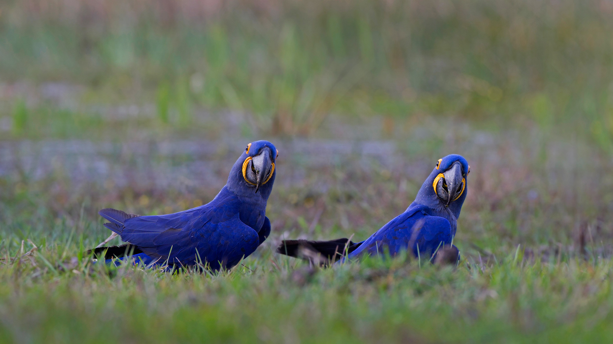

```json
{
  "images": [
    {
      "startdate": "20210930",
      "fullstartdate": "202109301600",
      "enddate": "20211001",
      "url": "/th?id=OHR.HyacinthMacaws_ZH-CN1191345036_1920x1080.jpg&rf=LaDigue_1920x1080.jpg&pid=hp",
      "urlbase": "/th?id=OHR.HyacinthMacaws_ZH-CN1191345036",
      "copyright": "潘塔纳尔湿地的风信子金刚鹦鹉，巴西 (© David Pattyn/Minden Pictures)",
      "copyrightlink": "https://www.bing.com/search?q=%E9%A3%8E%E4%BF%A1%E5%AD%90%E9%87%91%E5%88%9A%E9%B9%A6%E9%B9%89h&form=hpcapt&mkt=zh-cn",
      "title": "",
      "quiz": "/search?q=Bing+homepage+quiz&filters=WQOskey:%22HPQuiz_20210930_HyacinthMacaws%22&FORM=HPQUIZ",
      "wp": true,
      "hsh": "56974ee88835f0bb78072b501b4f2c9d",
      "drk": 1,
      "top": 1,
      "bot": 1,
      "hs": []
    }
  ],
  "tooltips": {
    "loading": "正在加载...",
    "previous": "上一个图像",
    "next": "下一个图像",
    "walle": "此图片不能下载用作壁纸。",
    "walls": "下载今日美图。仅限用作桌面壁纸。"
  }
}
```
