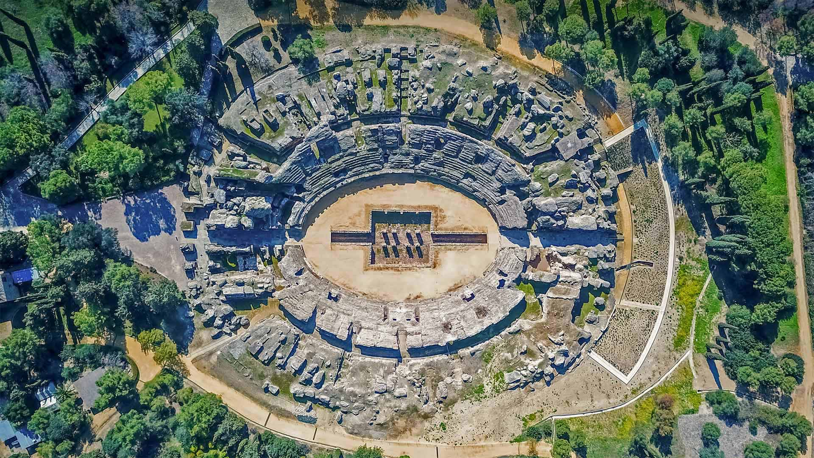

```json
{
  "images": [
    {
      "startdate": "20211002",
      "fullstartdate": "202110021600",
      "enddate": "20211003",
      "url": "/th?id=OHR.Italica_ZH-CN1692906751_1920x1080.jpg&rf=LaDigue_1920x1080.jpg&pid=hp",
      "urlbase": "/th?id=OHR.Italica_ZH-CN1692906751",
      "copyright": "古罗马斗兽场，西班牙桑蒂蓬塞镇的罗马古城遗迹 (© Amazing Aerial Agency/Offset by Shutterstock)",
      "copyrightlink": "https://www.bing.com/search?q=%E6%A1%91%E8%92%82%E8%93%AC%E5%A1%9E&form=hpcapt&mkt=zh-cn",
      "title": "",
      "quiz": "/search?q=Bing+homepage+quiz&filters=WQOskey:%22HPQuiz_20211002_Italica%22&FORM=HPQUIZ",
      "wp": true,
      "hsh": "f6ecc650569c7aace1f10188735ef0b0",
      "drk": 1,
      "top": 1,
      "bot": 1,
      "hs": []
    }
  ],
  "tooltips": {
    "loading": "正在加载...",
    "previous": "上一个图像",
    "next": "下一个图像",
    "walle": "此图片不能下载用作壁纸。",
    "walls": "下载今日美图。仅限用作桌面壁纸。"
  }
}
```
