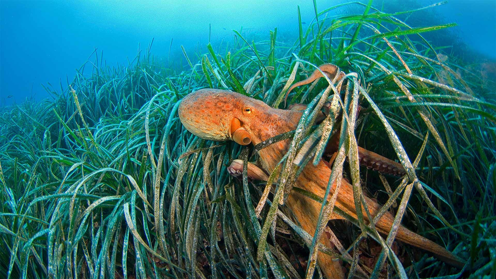

```json
{
  "images": [
    {
      "startdate": "20211007",
      "fullstartdate": "202110071600",
      "enddate": "20211008",
      "url": "/th?id=OHR.FriendlyOctopus_ZH-CN2519447724_1920x1080.jpg&rf=LaDigue_1920x1080.jpg&pid=hp",
      "urlbase": "/th?id=OHR.FriendlyOctopus_ZH-CN2519447724",
      "copyright": "海草中的章鱼，法国利翁湾 (© BIOSPHOTO/Alamy)",
      "copyrightlink": "https://www.bing.com/search?q=%E7%AB%A0%E9%B1%BC&form=hpcapt&mkt=zh-cn",
      "title": "",
      "quiz": "/search?q=Bing+homepage+quiz&filters=WQOskey:%22HPQuiz_20211007_FriendlyOctopus%22&FORM=HPQUIZ",
      "wp": true,
      "hsh": "2e4cdcc79efcd8dd814ce96c12f19125",
      "drk": 1,
      "top": 1,
      "bot": 1,
      "hs": []
    }
  ],
  "tooltips": {
    "loading": "正在加载...",
    "previous": "上一个图像",
    "next": "下一个图像",
    "walle": "此图片不能下载用作壁纸。",
    "walls": "下载今日美图。仅限用作桌面壁纸。"
  }
}
```
