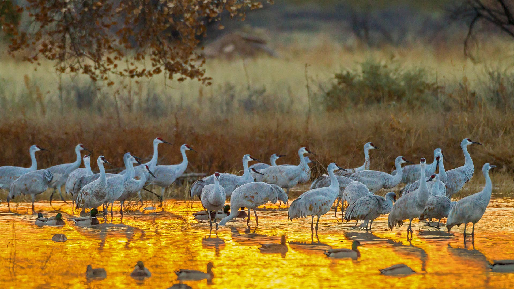

```json
{
  "images": [
    {
      "startdate": "20211008",
      "fullstartdate": "202110081600",
      "enddate": "20211009",
      "url": "/th?id=OHR.SandhillApache_ZH-CN3021579142_1920x1080.jpg&rf=LaDigue_1920x1080.jpg&pid=hp",
      "urlbase": "/th?id=OHR.SandhillApache_ZH-CN3021579142",
      "copyright": "野生动物保护区中的沙丘鹤和野鸭，美国新墨西哥州 (© Cathy & Gordon Illg/Jaynes Gallery/DanitaDelimont.com)",
      "copyrightlink": "https://www.bing.com/search?q=%E6%B2%99%E4%B8%98%E9%B9%A4&form=hpcapt&mkt=zh-cn",
      "title": "",
      "quiz": "/search?q=Bing+homepage+quiz&filters=WQOskey:%22HPQuiz_20211008_SandhillApache%22&FORM=HPQUIZ",
      "wp": true,
      "hsh": "5c83ea662bca58fd366cebc11a1b34f7",
      "drk": 1,
      "top": 1,
      "bot": 1,
      "hs": []
    }
  ],
  "tooltips": {
    "loading": "正在加载...",
    "previous": "上一个图像",
    "next": "下一个图像",
    "walle": "此图片不能下载用作壁纸。",
    "walls": "下载今日美图。仅限用作桌面壁纸。"
  }
}
```
