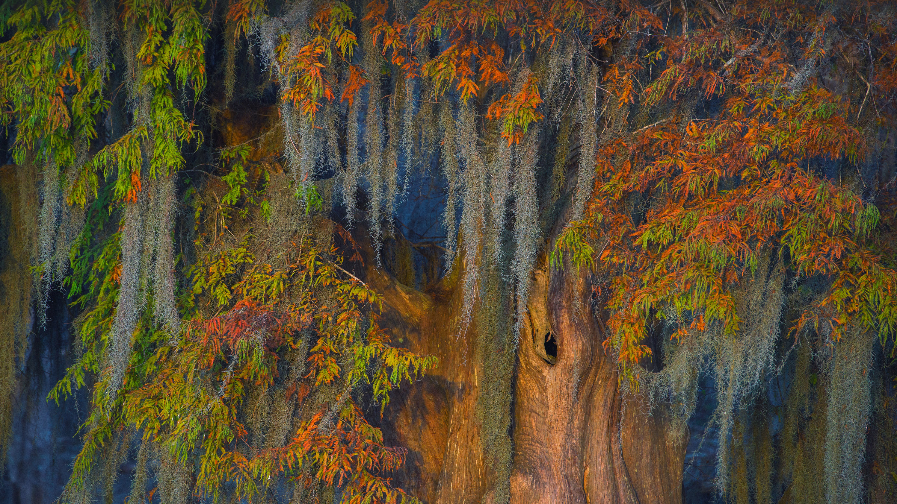

```json
{
  "images": [
    {
      "startdate": "20211020",
      "fullstartdate": "202110201600",
      "enddate": "20211021",
      "url": "/th?id=OHR.AtchafalayaMoss_ZH-CN6079994094_UHD.jpg&rf=LaDigue_UHD.jpg&pid=hp&w=3840&h=2160&rs=1&c=4",
      "urlbase": "/th?id=OHR.AtchafalayaMoss_ZH-CN6079994094",
      "copyright": "阿查法拉亚盆地的秃柏和西班牙苔藓，路易斯安那州 (© Chris Moore/Exploring Light Photography/Tandem Stills + Motion)",
      "copyrightlink": "/search?q=%e9%98%bf%e6%9f%a5%e6%b3%95%e6%8b%89%e4%ba%9a%e7%9b%86%e5%9c%b0&form=hpcapt&mkt=zh-cn",
      "title": "",
      "quiz": "/search?q=Bing+homepage+quiz&filters=WQOskey:%22HPQuiz_20211020_AtchafalayaMoss%22&FORM=HPQUIZ",
      "wp": true,
      "hsh": "e82da532a9590dcd89e1eb123759bfc7",
      "drk": 1,
      "top": 1,
      "bot": 1,
      "hs": []
    }
  ],
  "tooltips": {
    "loading": "正在加载...",
    "previous": "上一个图像",
    "next": "下一个图像",
    "walle": "此图片不能下载用作壁纸。",
    "walls": "下载今日美图。仅限用作桌面壁纸。"
  }
}
```
