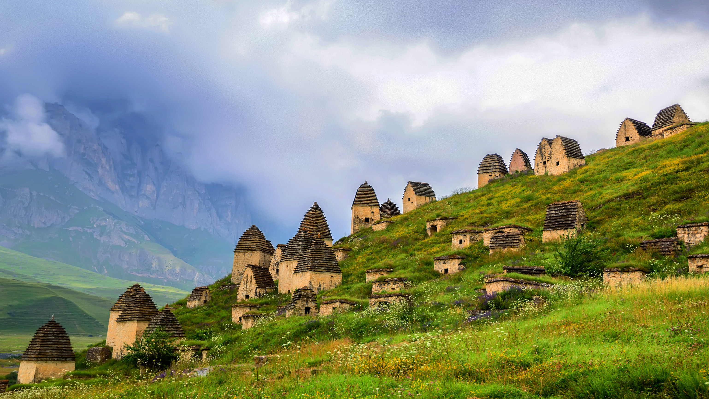

```json
{
  "images": [
    {
      "startdate": "20211027",
      "fullstartdate": "202110271600",
      "enddate": "20211028",
      "url": "/th?id=OHR.Dargavs_ZH-CN2721319869_UHD.jpg&rf=LaDigue_UHD.jpg&pid=hp&w=3840&h=2160&rs=1&c=4",
      "urlbase": "/th?id=OHR.Dargavs_ZH-CN2721319869",
      "copyright": "北奥塞梯-阿兰共和国的一片墓地，俄罗斯 (© Yakov Oskanov/Shutterstock)",
      "copyrightlink": "/search?q=%e5%8c%97%e5%a5%a5%e5%a1%9e%e6%a2%af-%e9%98%bf%e5%85%b0%e5%85%b1%e5%92%8c%e5%9b%bd&form=hpcapt&mkt=zh-cn",
      "title": "",
      "quiz": "/search?q=Bing+homepage+quiz&filters=WQOskey:%22HPQuiz_20211027_Dargavs%22&FORM=HPQUIZ",
      "wp": true,
      "hsh": "dec07a53720e890136b8ff091f6cb118",
      "drk": 1,
      "top": 1,
      "bot": 1,
      "hs": []
    }
  ],
  "tooltips": {
    "loading": "正在加载...",
    "previous": "上一个图像",
    "next": "下一个图像",
    "walle": "此图片不能下载用作壁纸。",
    "walls": "下载今日美图。仅限用作桌面壁纸。"
  }
}
```
