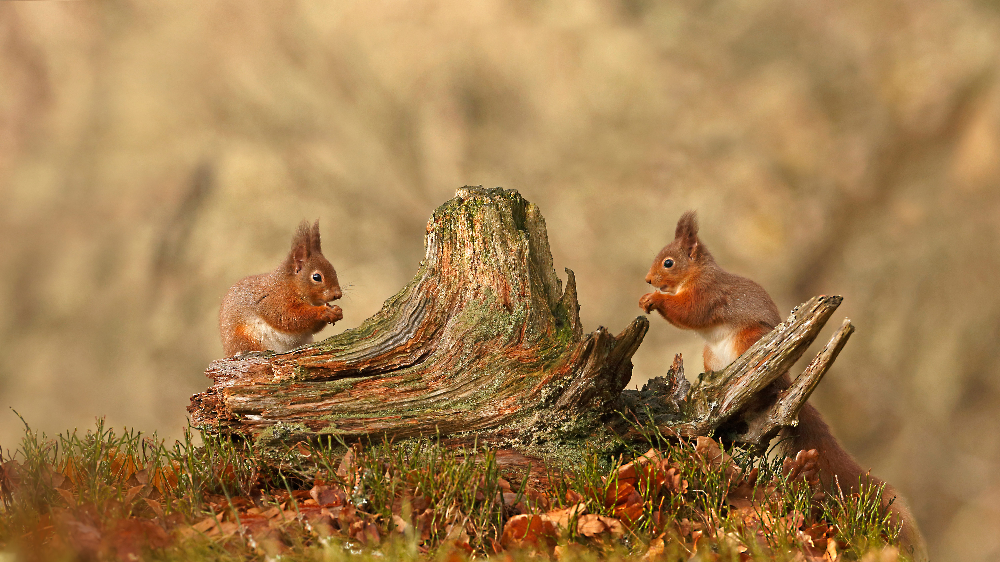

```json
{
  "images": [
    {
      "startdate": "20211124",
      "fullstartdate": "202111241600",
      "enddate": "20211125",
      "url": "/th?id=OHR.SquirrelsCairngorms_ZH-CN9369511507_UHD.jpg&rf=LaDigue_UHD.jpg&pid=hp&w=3840&h=2160&rs=1&c=4",
      "urlbase": "/th?id=OHR.SquirrelsCairngorms_ZH-CN9369511507",
      "copyright": "凯恩戈姆山国家公园的欧亚红松鼠，苏格兰高地 (© Scotland: The Big Picture/Minden Pictures)",
      "copyrightlink": "/search?q=%e6%ac%a7%e4%ba%9a%e7%ba%a2%e6%9d%be%e9%bc%a0&form=hpcapt&mkt=zh-cn",
      "title": "",
      "quiz": "/search?q=Bing+homepage+quiz&filters=WQOskey:%22HPQuiz_20211124_SquirrelsCairngorms%22&FORM=HPQUIZ",
      "wp": true,
      "hsh": "1657434bd6f3add04e418f28cdccd186",
      "drk": 1,
      "top": 1,
      "bot": 1,
      "hs": []
    }
  ],
  "tooltips": {
    "loading": "正在加载...",
    "previous": "上一个图像",
    "next": "下一个图像",
    "walle": "此图片不能下载用作壁纸。",
    "walls": "下载今日美图。仅限用作桌面壁纸。"
  }
}
```
