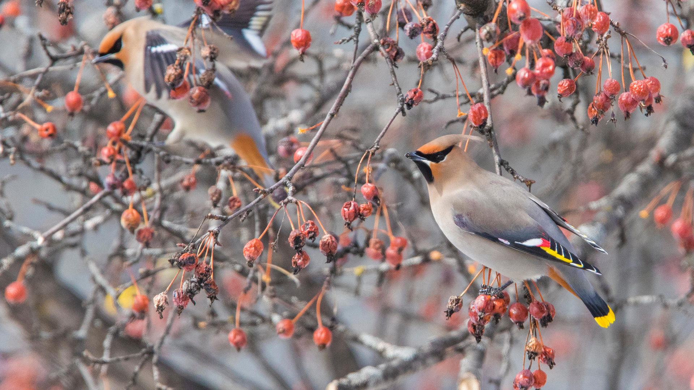

```json
{
  "images": [
    {
      "startdate": "20211125",
      "fullstartdate": "202111251600",
      "enddate": "20211126",
      "url": "/th?id=OHR.WinterWaxwing_ZH-CN9435499385_UHD.jpg&rf=LaDigue_UHD.jpg&pid=hp&w=3840&h=2160&rs=1&c=4",
      "urlbase": "/th?id=OHR.WinterWaxwing_ZH-CN9435499385",
      "copyright": "枝头上的太平鸟（北美亚种），加拿大 (© Mircea Costina/Alamy)",
      "copyrightlink": "/search?q=%e5%a4%aa%e5%b9%b3%e9%b8%9f%e5%8c%97%e7%be%8e%e4%ba%9a%e7%a7%8d&form=hpcapt&mkt=zh-cn",
      "title": "",
      "quiz": "/search?q=Bing+homepage+quiz&filters=WQOskey:%22HPQuiz_20211125_WinterWaxwing%22&FORM=HPQUIZ",
      "wp": true,
      "hsh": "02aaf2a9250dfca9554592230ae9a105",
      "drk": 1,
      "top": 1,
      "bot": 1,
      "hs": []
    }
  ],
  "tooltips": {
    "loading": "正在加载...",
    "previous": "上一个图像",
    "next": "下一个图像",
    "walle": "此图片不能下载用作壁纸。",
    "walls": "下载今日美图。仅限用作桌面壁纸。"
  }
}
```
