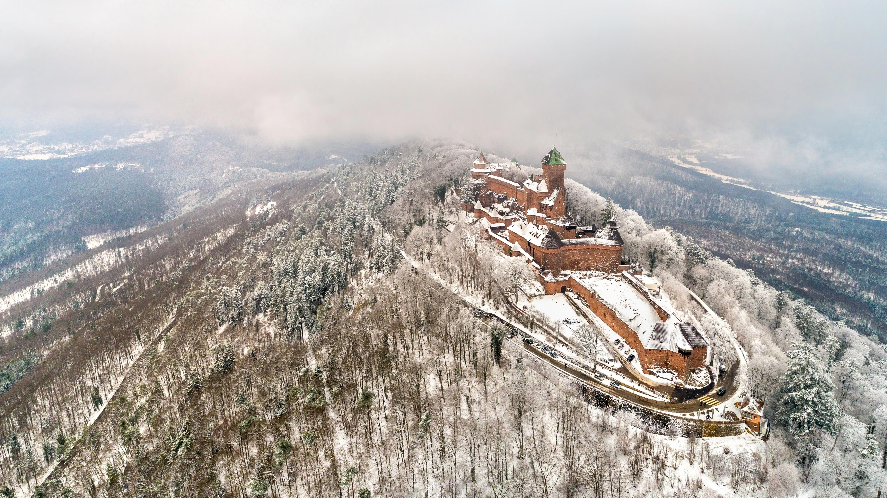

```json
{
  "images": [
    {
      "startdate": "20211206",
      "fullstartdate": "202112061600",
      "enddate": "20211207",
      "url": "/th?id=OHR.Koenigsbourg_ZH-CN7675452866_UHD.jpg&rf=LaDigue_UHD.jpg&pid=hp&w=3840&h=2160&rs=1&c=4",
      "urlbase": "/th?id=OHR.Koenigsbourg_ZH-CN7675452866",
      "copyright": "孚日山脉上的国王城堡，法国阿尔萨斯 (© Leonid Andronov/Shutterstock)",
      "copyrightlink": "/search?q=%e5%ad%9a%e6%97%a5%e5%b1%b1%e8%84%89&form=hpcapt&mkt=zh-cn",
      "title": "",
      "quiz": "/search?q=Bing+homepage+quiz&filters=WQOskey:%22HPQuiz_20211206_Koenigsbourg%22&FORM=HPQUIZ",
      "wp": true,
      "hsh": "fdba345c9abaa53b01e0bd2271c3b657",
      "drk": 1,
      "top": 1,
      "bot": 1,
      "hs": []
    }
  ],
  "tooltips": {
    "loading": "正在加载...",
    "previous": "上一个图像",
    "next": "下一个图像",
    "walle": "此图片不能下载用作壁纸。",
    "walls": "下载今日美图。仅限用作桌面壁纸。"
  }
}
```
