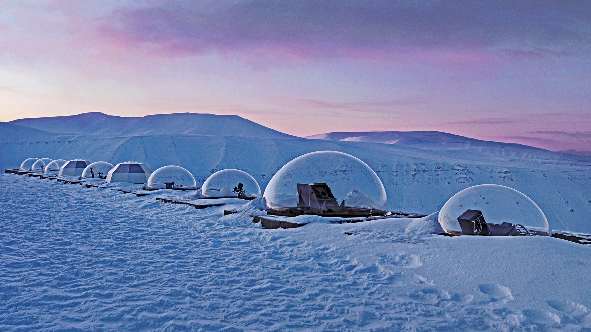

```json
{
  "images": [
    {
      "startdate": "20211227",
      "fullstartdate": "202112271600",
      "enddate": "20211228",
      "url": "/th?id=OHR.KjellHenriksen_ZH-CN6626275076_UHD.jpg&rf=LaDigue_UHD.jpg&pid=hp&w=3840&h=2160&rs=1&c=4",
      "urlbase": "/th?id=OHR.KjellHenriksen_ZH-CN6626275076",
      "copyright": "半球形的谢尔亨里克森天文台，挪威斯瓦尔巴群岛 (© Vincent Fournier/Gallery Stock)",
      "copyrightlink": "/search?q=%e6%96%af%e7%93%a6%e5%b0%94%e5%b7%b4%e7%be%a4%e5%b2%9b&form=hpcapt&mkt=zh-cn",
      "title": "",
      "quiz": "/search?q=Bing+homepage+quiz&filters=WQOskey:%22HPQuiz_20211227_KjellHenriksen%22&FORM=HPQUIZ",
      "wp": true,
      "hsh": "95647ebdb997b79e9447dc0dbfd80fbc",
      "drk": 1,
      "top": 1,
      "bot": 1,
      "hs": []
    }
  ],
  "tooltips": {
    "loading": "正在加载...",
    "previous": "上一个图像",
    "next": "下一个图像",
    "walle": "此图片不能下载用作壁纸。",
    "walls": "下载今日美图。仅限用作桌面壁纸。"
  }
}
```
