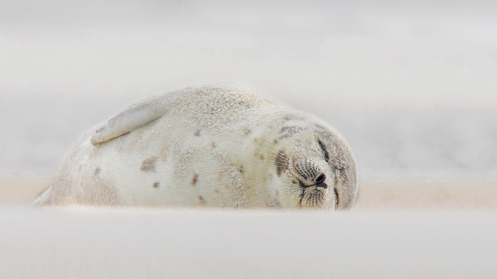

```json
{
  "images": [
    {
      "startdate": "20211231",
      "fullstartdate": "202112311600",
      "enddate": "20220101",
      "url": "/th?id=OHR.JonesBeachHarpSeal_ZH-CN9584238333_UHD.jpg&rf=LaDigue_UHD.jpg&pid=hp&w=3840&h=2160&rs=1&c=4",
      "urlbase": "/th?id=OHR.JonesBeachHarpSeal_ZH-CN9584238333",
      "copyright": "睡在海滩上的竖琴海豹，纽约长岛 (© Vicki Jauron, Babylon and Beyond Photography/Getty Images)",
      "copyrightlink": "/search?q=%e7%ab%96%e7%90%b4%e6%b5%b7%e8%b1%b9&form=hpcapt&mkt=zh-cn",
      "title": "",
      "quiz": "/search?q=Bing+homepage+quiz&filters=WQOskey:%22HPQuiz_20211231_JonesBeachHarpSeal%22&FORM=HPQUIZ",
      "wp": true,
      "hsh": "94c28b7ce326347587d2a782ab49a37f",
      "drk": 1,
      "top": 1,
      "bot": 1,
      "hs": []
    }
  ],
  "tooltips": {
    "loading": "正在加载...",
    "previous": "上一个图像",
    "next": "下一个图像",
    "walle": "此图片不能下载用作壁纸。",
    "walls": "下载今日美图。仅限用作桌面壁纸。"
  }
}
```
