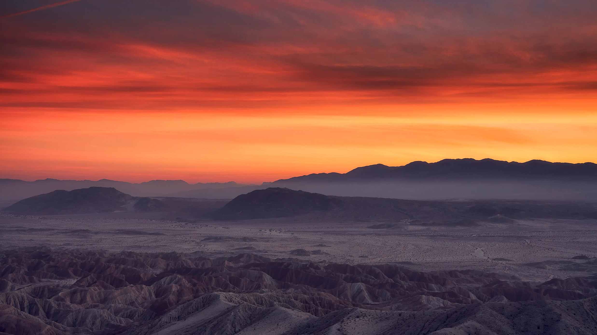

```json
{
  "images": [
    {
      "startdate": "20220103",
      "fullstartdate": "202201031600",
      "enddate": "20220104",
      "url": "/th?id=OHR.BorregoBadlands_ZH-CN9913349081_UHD.jpg&rf=LaDigue_UHD.jpg&pid=hp&w=3840&h=2160&rs=1&c=4",
      "urlbase": "/th?id=OHR.BorregoBadlands_ZH-CN9913349081",
      "copyright": "安沙波利哥沙漠州立公园，美国加利福尼亚州 (© Tom Hogan/plainpicture)",
      "copyrightlink": "/search?q=%e5%ae%89%e6%b2%99%e6%b3%a2%e5%88%a9%e5%93%a5%e6%b2%99%e6%bc%a0%e5%b7%9e%e7%ab%8b%e5%85%ac%e5%9b%ad&form=hpcapt&mkt=zh-cn",
      "title": "",
      "quiz": "/search?q=Bing+homepage+quiz&filters=WQOskey:%22HPQuiz_20220103_BorregoBadlands%22&FORM=HPQUIZ",
      "wp": true,
      "hsh": "8f3d20c74960b199b364f0bb744a9f69",
      "drk": 1,
      "top": 1,
      "bot": 1,
      "hs": []
    }
  ],
  "tooltips": {
    "loading": "正在加载...",
    "previous": "上一个图像",
    "next": "下一个图像",
    "walle": "此图片不能下载用作壁纸。",
    "walls": "下载今日美图。仅限用作桌面壁纸。"
  }
}
```
