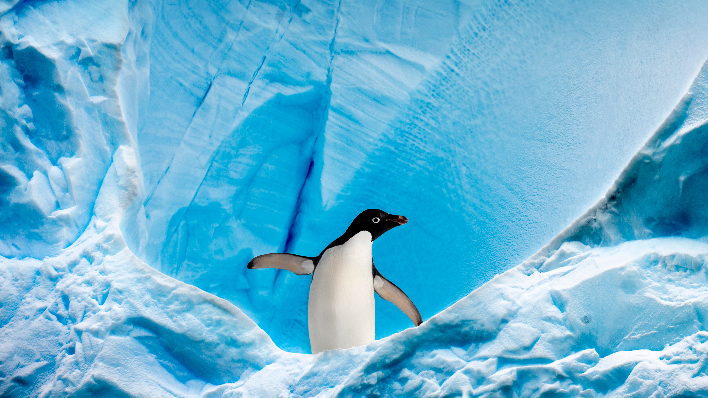

```json
{
  "images": [
    {
      "startdate": "20220119",
      "fullstartdate": "202201191600",
      "enddate": "20220120",
      "url": "/th?id=OHR.GrahamAdelie_ZH-CN2945763969_UHD.jpg&rf=LaDigue_UHD.jpg&pid=hp&w=3840&h=2160&rs=1&c=4",
      "urlbase": "/th?id=OHR.GrahamAdelie_ZH-CN2945763969",
      "copyright": "格雷厄姆海峡的阿德利企鹅，南极洲南极半岛 (© Nick Garbutt/Minden Pictures)",
      "copyrightlink": "/search?q=%e9%98%bf%e5%be%b7%e5%88%a9%e4%bc%81%e9%b9%85&form=hpcapt&mkt=zh-cn",
      "title": "",
      "quiz": "/search?q=Bing+homepage+quiz&filters=WQOskey:%22HPQuiz_20220119_GrahamAdelie%22&FORM=HPQUIZ",
      "wp": true,
      "hsh": "4712039f66c2703aadd57ffa7b16f918",
      "drk": 1,
      "top": 1,
      "bot": 1,
      "hs": []
    }
  ],
  "tooltips": {
    "loading": "正在加载...",
    "previous": "上一个图像",
    "next": "下一个图像",
    "walle": "此图片不能下载用作壁纸。",
    "walls": "下载今日美图。仅限用作桌面壁纸。"
  }
}
```
