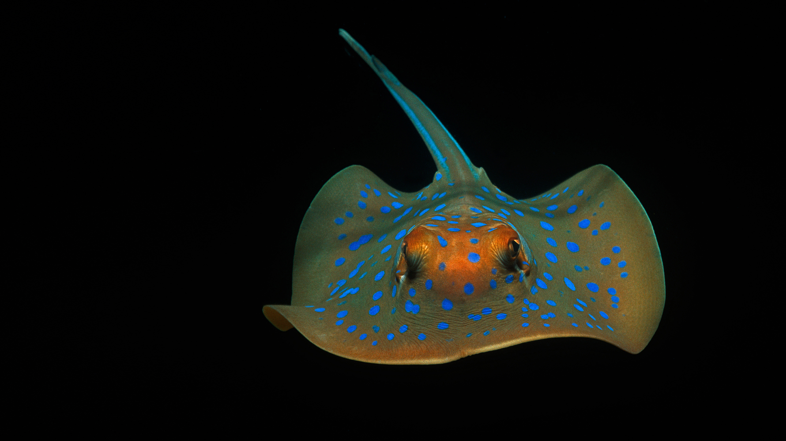

```json
{
  "images": [
    {
      "startdate": "20220126",
      "fullstartdate": "202201261600",
      "enddate": "20220127",
      "url": "/th?id=OHR.RibbontailStingray_ZH-CN3248204214_UHD.jpg&rf=LaDigue_UHD.jpg&pid=hp&w=3840&h=2160&rs=1&c=4",
      "urlbase": "/th?id=OHR.RibbontailStingray_ZH-CN3248204214",
      "copyright": "珀斯附近海域的蓝斑条尾魟，澳大利亚 (© Jeff Rotman/Minden Pictures)",
      "copyrightlink": "/search?q=%e8%93%9d%e6%96%91%e6%9d%a1%e5%b0%be%e9%ad%9f&form=hpcapt&mkt=zh-cn",
      "title": "",
      "quiz": "/search?q=Bing+homepage+quiz&filters=WQOskey:%22HPQuiz_20220126_RibbontailStingray%22&FORM=HPQUIZ",
      "wp": true,
      "hsh": "32797eeb07b5b9aa050cfb781b17c5d7",
      "drk": 1,
      "top": 1,
      "bot": 1,
      "hs": []
    }
  ],
  "tooltips": {
    "loading": "正在加载...",
    "previous": "上一个图像",
    "next": "下一个图像",
    "walle": "此图片不能下载用作壁纸。",
    "walls": "下载今日美图。仅限用作桌面壁纸。"
  }
}
```
