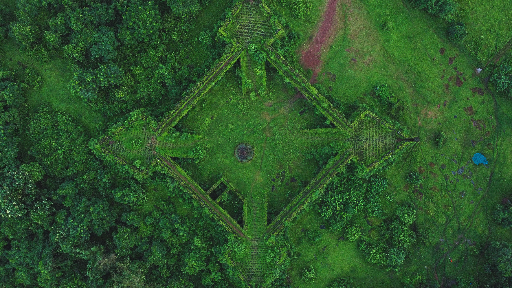

```json
{
  "images": [
    {
      "startdate": "20220202",
      "fullstartdate": "202202021600",
      "enddate": "20220203",
      "url": "/th?id=OHR.FortCorjuem_ZH-CN7295613217_UHD.jpg&rf=LaDigue_UHD.jpg&pid=hp&w=3840&h=2160&rs=1&c=4",
      "urlbase": "/th?id=OHR.FortCorjuem_ZH-CN7295613217",
      "copyright": "Corjuem堡垒，印度果阿邦 (© Ingvar Kuznetsov/Shutterstock)",
      "copyrightlink": "/search?q=%e6%9e%9c%e9%98%bf%e9%82%a6&form=hpcapt&mkt=zh-cn",
      "title": "自森林中开垦出的堡垒",
      "quiz": "/search?q=Bing+homepage+quiz&filters=WQOskey:%22HPQuiz_20220202_FortCorjuem%22&FORM=HPQUIZ",
      "wp": true,
      "hsh": "59c0a7710f2b9dc48081c874f7ee4081",
      "drk": 1,
      "top": 1,
      "bot": 1,
      "hs": []
    }
  ],
  "tooltips": {
    "loading": "正在加载...",
    "previous": "上一个图像",
    "next": "下一个图像",
    "walle": "此图片不能下载用作壁纸。",
    "walls": "下载今日美图。仅限用作桌面壁纸。"
  }
}
```
