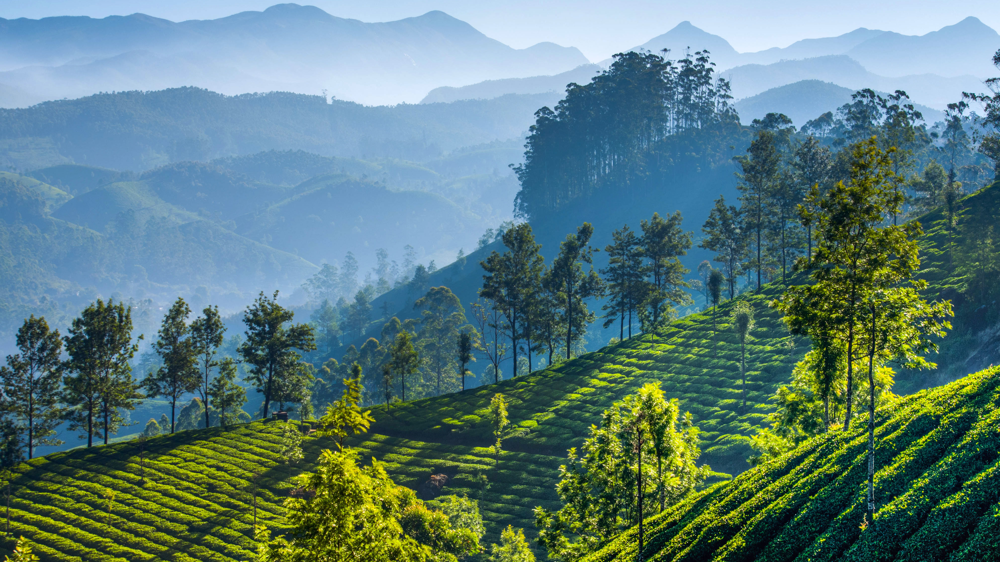

```json
{
  "images": [
    {
      "startdate": "20220210",
      "fullstartdate": "202202101600",
      "enddate": "20220211",
      "url": "/th?id=OHR.TeaGardensMunnar_ZH-CN9587720369_UHD.jpg&rf=LaDigue_UHD.jpg&pid=hp&w=3840&h=2160&rs=1&c=4",
      "urlbase": "/th?id=OHR.TeaGardensMunnar_ZH-CN9587720369",
      "copyright": "慕那尔山区的茶园，印度喀拉拉邦 (© SvitlanaBelinska/iStock/Getty Images Plus)",
      "copyrightlink": "/search?q=%e5%96%80%e6%8b%89%e6%8b%89%e9%82%a6&form=hpcapt&mkt=zh-cn",
      "title": "印度慕纳尔",
      "quiz": "/search?q=Bing+homepage+quiz&filters=WQOskey:%22HPQuiz_20220210_TeaGardensMunnar%22&FORM=HPQUIZ",
      "wp": true,
      "hsh": "19e3394244201ef6b791286fa20ca514",
      "drk": 1,
      "top": 1,
      "bot": 1,
      "hs": []
    }
  ],
  "tooltips": {
    "loading": "正在加载...",
    "previous": "上一个图像",
    "next": "下一个图像",
    "walle": "此图片不能下载用作壁纸。",
    "walls": "下载今日美图。仅限用作桌面壁纸。"
  }
}
```
