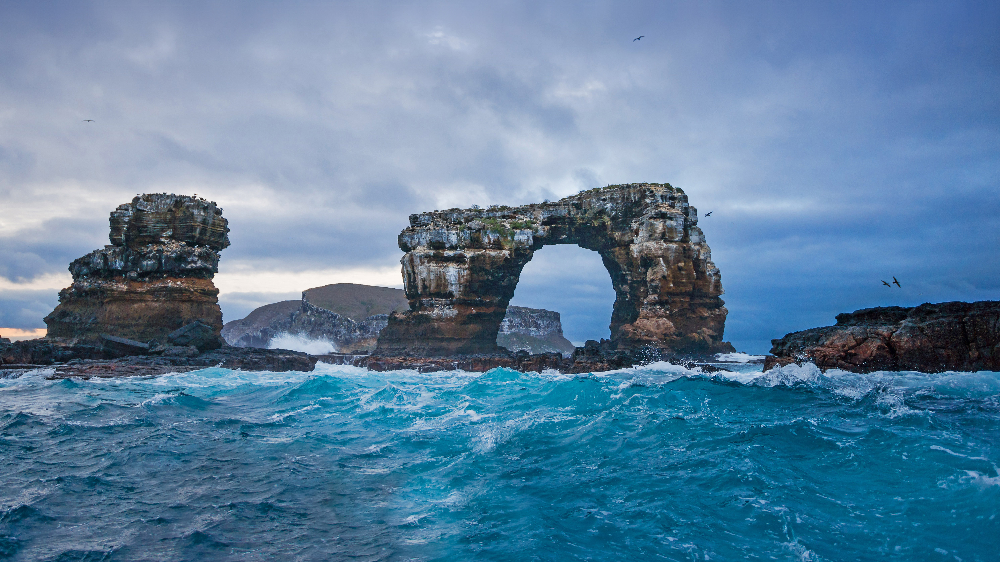

```json
{
  "images": [
    {
      "startdate": "20220211",
      "fullstartdate": "202202111600",
      "enddate": "20220212",
      "url": "/th?id=OHR.DarwinsArch_ZH-CN9740478501_UHD.jpg&rf=LaDigue_UHD.jpg&pid=hp&w=3840&h=2160&rs=1&c=4",
      "urlbase": "/th?id=OHR.DarwinsArch_ZH-CN9740478501",
      "copyright": "达尔文岛的达尔文拱门，厄瓜多尔加拉帕戈斯 (© miralex/Getty Images)",
      "copyrightlink": "/search?q=%e8%be%be%e5%b0%94%e6%96%87%e6%8b%b1%e9%97%a8&form=hpcapt&mkt=zh-cn",
      "title": "著名海拱门的末日",
      "quiz": "/search?q=Bing+homepage+quiz&filters=WQOskey:%22HPQuiz_20220211_DarwinsArch%22&FORM=HPQUIZ",
      "wp": true,
      "hsh": "28a653f619adea3e00d7e7769c38cc28",
      "drk": 1,
      "top": 1,
      "bot": 1,
      "hs": []
    }
  ],
  "tooltips": {
    "loading": "正在加载...",
    "previous": "上一个图像",
    "next": "下一个图像",
    "walle": "此图片不能下载用作壁纸。",
    "walls": "下载今日美图。仅限用作桌面壁纸。"
  }
}
```
