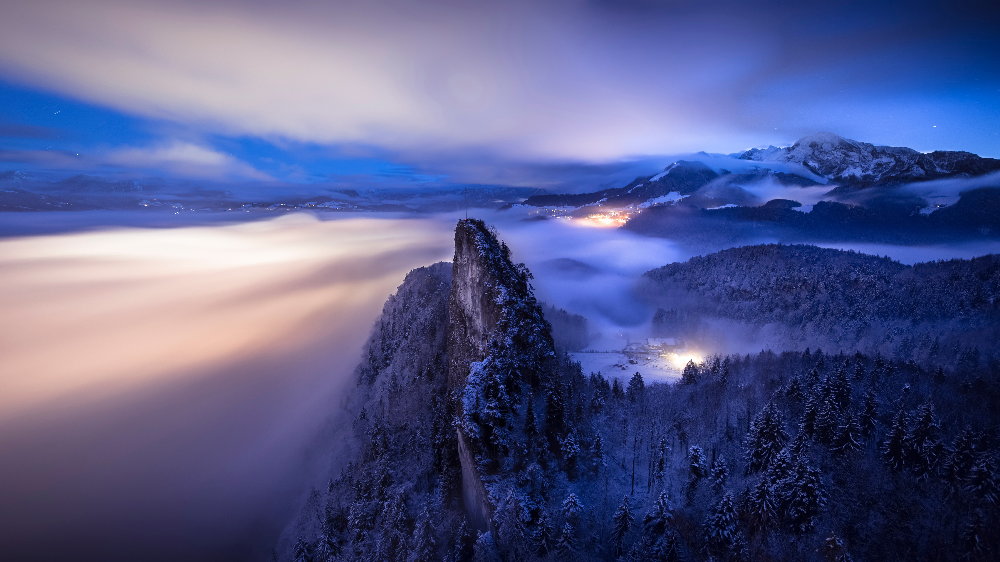

```json
{
  "images": [
    {
      "startdate": "20220218",
      "fullstartdate": "202202181600",
      "enddate": "20220219",
      "url": "/th?id=OHR.BerchtesgadenerAlpen_ZH-CN0740088231_UHD.jpg&rf=LaDigue_UHD.jpg&pid=hp&w=3840&h=2160&rs=1&c=4",
      "urlbase": "/th?id=OHR.BerchtesgadenerAlpen_ZH-CN0740088231",
      "copyright": "贝希特斯加登阿尔卑斯山脉全景，德国巴伐利亚州 (© Spotcatch/Westend61/Offset)",
      "copyrightlink": "/search?q=%e9%98%bf%e5%b0%94%e5%8d%91%e6%96%af%e5%b1%b1%e8%84%89&form=hpcapt&mkt=zh-cn",
      "title": "冬日阿尔卑斯山脉的高峰",
      "quiz": "/search?q=Bing+homepage+quiz&filters=WQOskey:%22HPQuiz_20220218_BerchtesgadenerAlpen%22&FORM=HPQUIZ",
      "wp": true,
      "hsh": "bd110e259e7e9f5609d69a367d0839ef",
      "drk": 1,
      "top": 1,
      "bot": 1,
      "hs": []
    }
  ],
  "tooltips": {
    "loading": "正在加载...",
    "previous": "上一个图像",
    "next": "下一个图像",
    "walle": "此图片不能下载用作壁纸。",
    "walls": "下载今日美图。仅限用作桌面壁纸。"
  }
}
```
