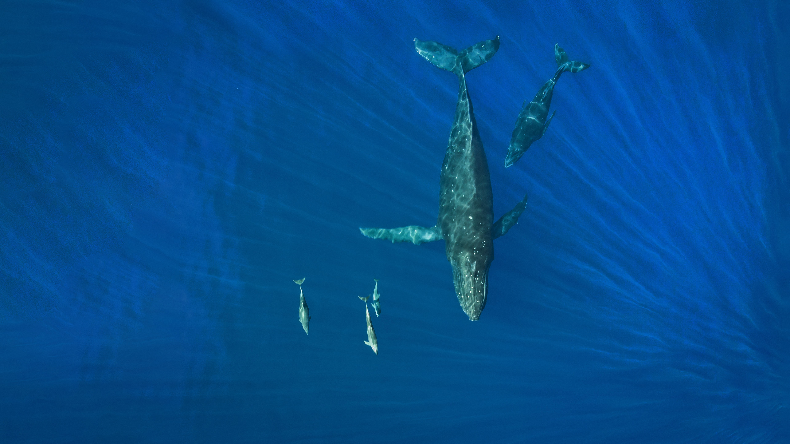

```json
{
  "images": [
    {
      "startdate": "20220219",
      "fullstartdate": "202202191600",
      "enddate": "20220220",
      "url": "/th?id=OHR.WhalesDolphins_ZH-CN0636695997_UHD.jpg&rf=LaDigue_UHD.jpg&pid=hp&w=3840&h=2160&rs=1&c=4",
      "urlbase": "/th?id=OHR.WhalesDolphins_ZH-CN0636695997",
      "copyright": "在海洋里畅游的座头鲸和海豚，美国夏威夷州 (© drewsulockcreations/Getty Images)",
      "copyrightlink": "/search?q=%e5%ba%a7%e5%a4%b4%e9%b2%b8&form=hpcapt&mkt=zh-cn",
      "title": "世界鲸鱼日快乐",
      "quiz": "/search?q=Bing+homepage+quiz&filters=WQOskey:%22HPQuiz_20220219_WhalesDolphins%22&FORM=HPQUIZ",
      "wp": true,
      "hsh": "b23d66d44fdbdb6d80bda000e9858da4",
      "drk": 1,
      "top": 1,
      "bot": 1,
      "hs": []
    }
  ],
  "tooltips": {
    "loading": "正在加载...",
    "previous": "上一个图像",
    "next": "下一个图像",
    "walle": "此图片不能下载用作壁纸。",
    "walls": "下载今日美图。仅限用作桌面壁纸。"
  }
}
```
