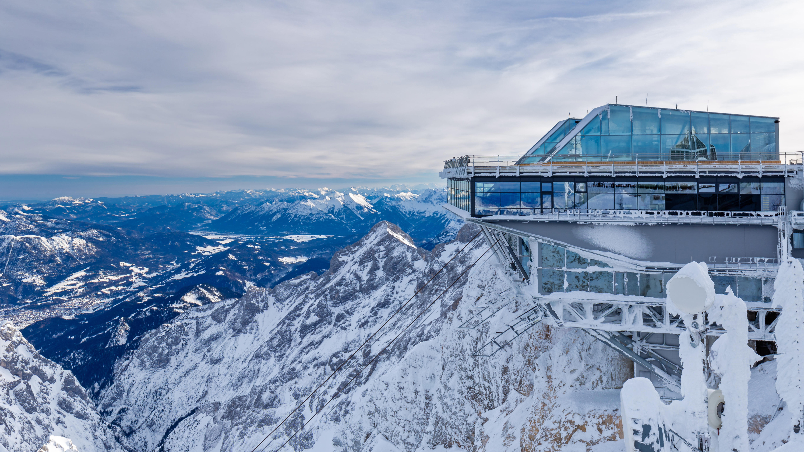

```json
{
  "images": [
    {
      "startdate": "20220228",
      "fullstartdate": "202202281600",
      "enddate": "20220301",
      "url": "/th?id=OHR.ZugspitzeGipfelstation_ZH-CN6120971585_UHD.jpg&rf=LaDigue_UHD.jpg&pid=hp&w=3840&h=2160&rs=1&c=4",
      "urlbase": "/th?id=OHR.ZugspitzeGipfelstation_ZH-CN6120971585",
      "copyright": "楚格峰山顶的缆车站，德国格赖瑙市 (© Robert Jank/Alamy)",
      "copyrightlink": "/search?q=%e6%a5%9a%e6%a0%bc%e5%b3%b0&form=hpcapt&mkt=zh-cn",
      "title": "位于德国最高的山上",
      "quiz": "/search?q=Bing+homepage+quiz&filters=WQOskey:%22HPQuiz_20220228_ZugspitzeGipfelstation%22&FORM=HPQUIZ",
      "wp": true,
      "hsh": "f0011dc0e9b553459915652b64227765",
      "drk": 1,
      "top": 1,
      "bot": 1,
      "hs": []
    }
  ],
  "tooltips": {
    "loading": "正在加载...",
    "previous": "上一个图像",
    "next": "下一个图像",
    "walle": "此图片不能下载用作壁纸。",
    "walls": "下载今日美图。仅限用作桌面壁纸。"
  }
}
```
