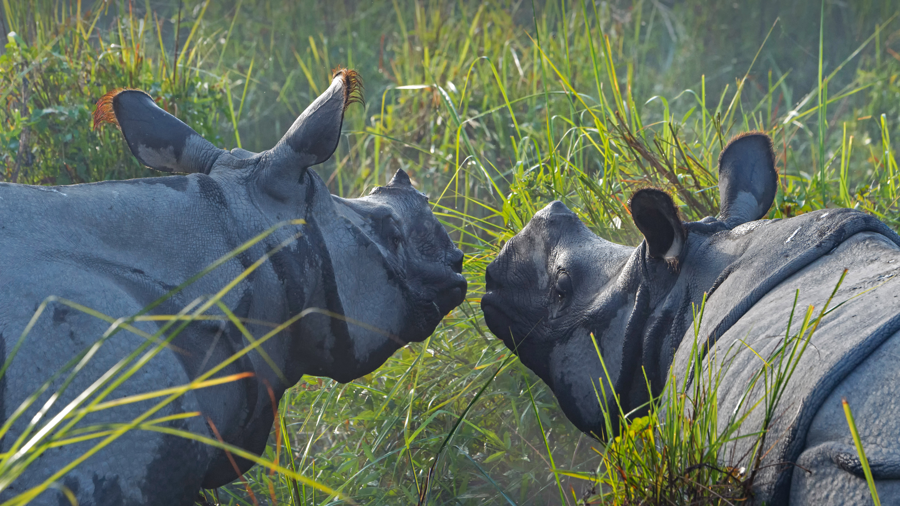

```json
{
  "images": [
    {
      "startdate": "20220302",
      "fullstartdate": "202203021600",
      "enddate": "20220303",
      "url": "/th?id=OHR.RhinocerosUnicornis_ZH-CN6380546992_UHD.jpg&rf=LaDigue_UHD.jpg&pid=hp&w=3840&h=2160&rs=1&c=4",
      "urlbase": "/th?id=OHR.RhinocerosUnicornis_ZH-CN6380546992",
      "copyright": "加济兰加国家公园里的两头印度犀，印度阿萨姆邦 (© Robert Harding World Imagery/Shutterstock)",
      "copyrightlink": "/search?q=%e5%8d%b0%e5%ba%a6%e7%8a%80%e7%89%9b&form=hpcapt&mkt=zh-cn",
      "title": "庆祝世界野生动物日",
      "quiz": "/search?q=Bing+homepage+quiz&filters=WQOskey:%22HPQuiz_20220302_RhinocerosUnicornis%22&FORM=HPQUIZ",
      "wp": true,
      "hsh": "8a99df7039cfe7293d019fd370f6b363",
      "drk": 1,
      "top": 1,
      "bot": 1,
      "hs": []
    }
  ],
  "tooltips": {
    "loading": "正在加载...",
    "previous": "上一个图像",
    "next": "下一个图像",
    "walle": "此图片不能下载用作壁纸。",
    "walls": "下载今日美图。仅限用作桌面壁纸。"
  }
}
```
