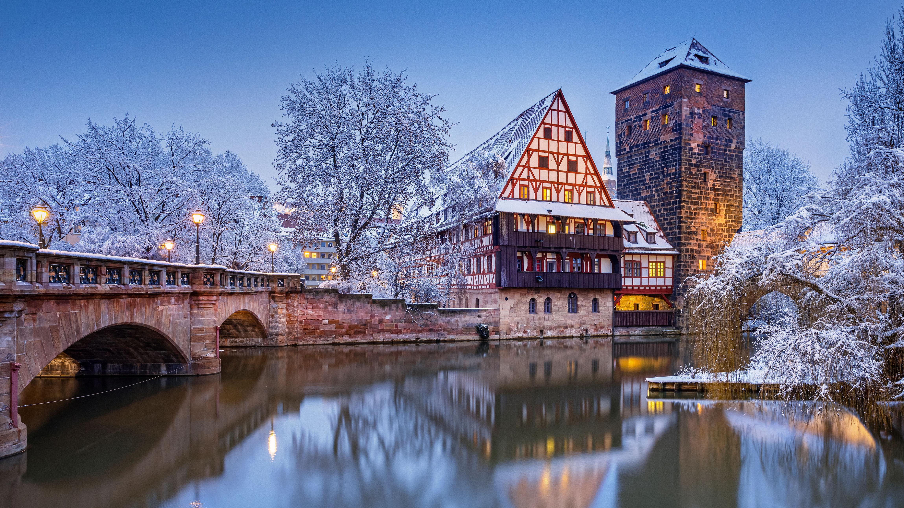

```json
{
  "images": [
    {
      "startdate": "20220303",
      "fullstartdate": "202203031600",
      "enddate": "20220304",
      "url": "/th?id=OHR.WeinstadelNuernberg_ZH-CN6448054345_UHD.jpg&rf=LaDigue_UHD.jpg&pid=hp&w=3840&h=2160&rs=1&c=4",
      "urlbase": "/th?id=OHR.WeinstadelNuernberg_ZH-CN6448054345",
      "copyright": "佩格尼茨河上的葡萄酒窖，德国纽伦堡 (© Reinhard Schmid/Huber/eStock Photo)",
      "copyrightlink": "/search?q=%e4%bd%a9%e6%a0%bc%e5%b0%bc%e8%8c%a8%e6%b2%b3&form=hpcapt&mkt=zh-cn",
      "title": "佩格尼茨河上的半木结构建筑",
      "quiz": "/search?q=Bing+homepage+quiz&filters=WQOskey:%22HPQuiz_20220303_WeinstadelNuernberg%22&FORM=HPQUIZ",
      "wp": true,
      "hsh": "3f3daf5435f26835d6c5eed9fd732dd7",
      "drk": 1,
      "top": 1,
      "bot": 1,
      "hs": []
    }
  ],
  "tooltips": {
    "loading": "正在加载...",
    "previous": "上一个图像",
    "next": "下一个图像",
    "walle": "此图片不能下载用作壁纸。",
    "walls": "下载今日美图。仅限用作桌面壁纸。"
  }
}
```
