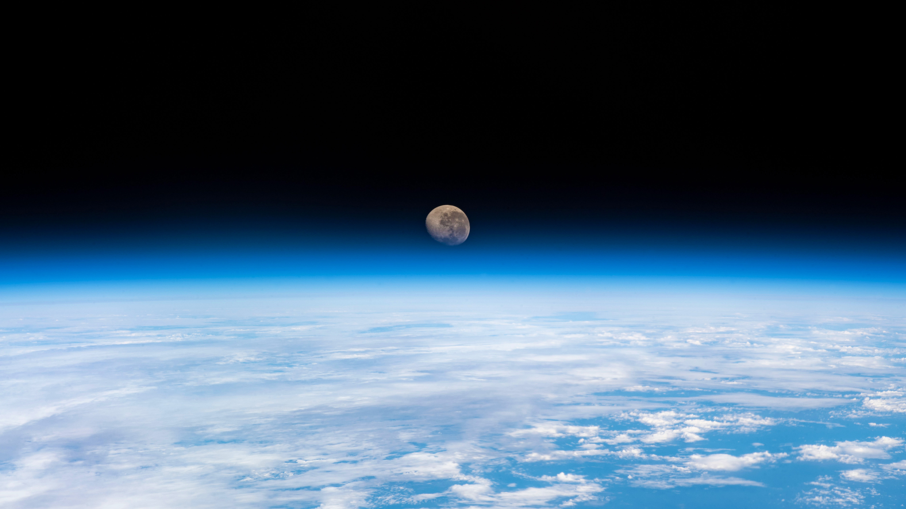

```json
{
  "images": [
    {
      "startdate": "20220411",
      "fullstartdate": "202204111600",
      "enddate": "20220412",
      "url": "/th?id=OHR.WaningGibbous_ZH-CN9648865417_UHD.jpg&rf=LaDigue_UHD.jpg&pid=hp&w=3840&h=2160&rs=1&c=4",
      "urlbase": "/th?id=OHR.WaningGibbous_ZH-CN9648865417",
      "copyright": "从国际空间站拍摄到的地球上方的渐亏凸月 (© NASA)",
      "copyrightlink": "/search?q=%e5%9b%bd%e9%99%85%e8%bd%bd%e4%ba%ba%e8%88%aa%e5%a4%a9%e6%97%a5&form=hpcapt&mkt=zh-cn",
      "title": "尤里之夜的凸月",
      "quiz": "/search?q=Bing+homepage+quiz&filters=WQOskey:%22HPQuiz_20220411_WaningGibbous%22&FORM=HPQUIZ",
      "wp": true,
      "hsh": "96457038398df14d2e749de171c72151",
      "drk": 1,
      "top": 1,
      "bot": 1,
      "hs": []
    }
  ],
  "tooltips": {
    "loading": "正在加载...",
    "previous": "上一个图像",
    "next": "下一个图像",
    "walle": "此图片不能下载用作壁纸。",
    "walls": "下载今日美图。仅限用作桌面壁纸。"
  }
}
```
