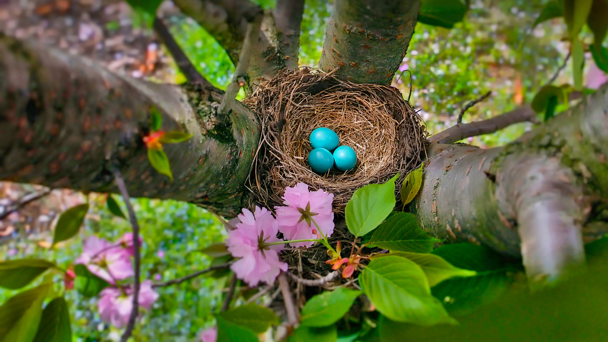

```json
{
  "images": [
    {
      "startdate": "20220416",
      "fullstartdate": "202204161600",
      "enddate": "20220417",
      "url": "/th?id=OHR.RobinsEgg_ZH-CN0838507211_UHD.jpg&rf=LaDigue_UHD.jpg&pid=hp&w=3840&h=2160&rs=1&c=4",
      "urlbase": "/th?id=OHR.RobinsEgg_ZH-CN0838507211",
      "copyright": "蓝色的美洲知更鸟蛋，新泽西州 (© Mira/Alamy)",
      "copyrightlink": "/search?q=%e5%a4%8d%e6%b4%bb%e8%8a%82&form=hpcapt&mkt=zh-cn",
      "title": "这些鸡蛋不需要染色",
      "quiz": "/search?q=Bing+homepage+quiz&filters=WQOskey:%22HPQuiz_20220416_RobinsEgg%22&FORM=HPQUIZ",
      "wp": true,
      "hsh": "5d3f36fe3e1e36d5a19b0046c9fe7323",
      "drk": 1,
      "top": 1,
      "bot": 1,
      "hs": []
    }
  ],
  "tooltips": {
    "loading": "正在加载...",
    "previous": "上一个图像",
    "next": "下一个图像",
    "walle": "此图片不能下载用作壁纸。",
    "walls": "下载今日美图。仅限用作桌面壁纸。"
  }
}
```
