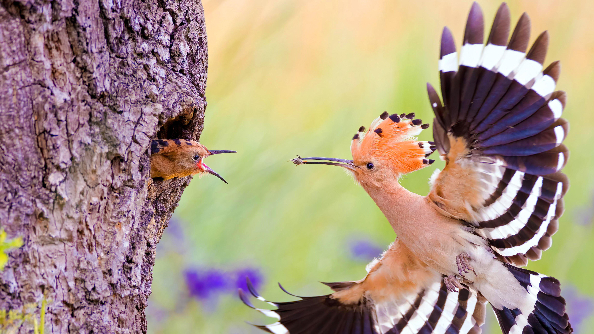

```json
{
  "images": [
    {
      "startdate": "20220429",
      "fullstartdate": "202204291600",
      "enddate": "20220430",
      "url": "/th?id=OHR.WiedehopfElbe_ZH-CN6286311611_UHD.jpg&rf=LaDigue_UHD.jpg&pid=hp&w=3840&h=2160&rs=1&c=4",
      "urlbase": "/th?id=OHR.WiedehopfElbe_ZH-CN6286311611",
      "copyright": "正在投喂幼鸟的戴胜鸟，德国 (© Slawek Staszczuk/Alamy)",
      "copyrightlink": "/search?q=%e6%88%b4%e8%83%9c%e9%b8%9f&form=hpcapt&mkt=zh-cn",
      "title": "喂养时间到了",
      "quiz": "/search?q=Bing+homepage+quiz&filters=WQOskey:%22HPQuiz_20220429_WiedehopfElbe%22&FORM=HPQUIZ",
      "wp": true,
      "hsh": "db7ab56f327499cfd8bcf8434809556d",
      "drk": 1,
      "top": 1,
      "bot": 1,
      "hs": []
    }
  ],
  "tooltips": {
    "loading": "正在加载...",
    "previous": "上一个图像",
    "next": "下一个图像",
    "walle": "此图片不能下载用作壁纸。",
    "walls": "下载今日美图。仅限用作桌面壁纸。"
  }
}
```
