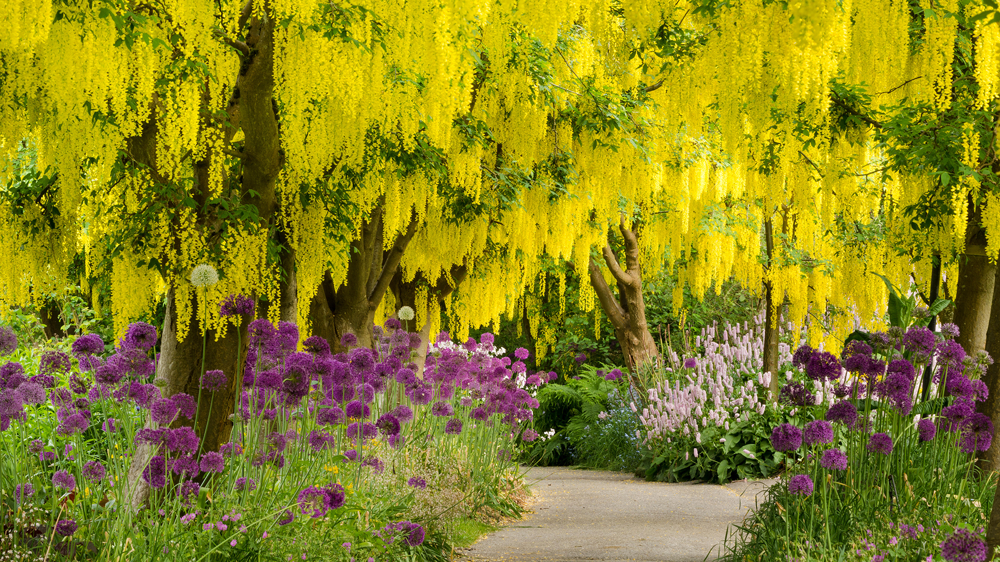

```json
{
  "images": [
    {
      "startdate": "20220430",
      "fullstartdate": "202204301600",
      "enddate": "20220501",
      "url": "/th?id=OHR.VanBlooms_ZH-CN6370306779_UHD.jpg&rf=LaDigue_UHD.jpg&pid=hp&w=3840&h=2160&rs=1&c=4",
      "urlbase": "/th?id=OHR.VanBlooms_ZH-CN6370306779",
      "copyright": "盛开的金链花树和紫色葱属植物，加拿大温哥华范度森植物园 (© Greg Vaughn/Alamy)",
      "copyrightlink": "/search?q=%e8%8c%83%e5%ba%a6%e6%a3%ae%e6%a4%8d%e7%89%a9%e5%9b%ad&form=hpcapt&mkt=zh-cn",
      "title": "一张来自春天的快照",
      "quiz": "/search?q=Bing+homepage+quiz&filters=WQOskey:%22HPQuiz_20220430_VanBlooms%22&FORM=HPQUIZ",
      "wp": true,
      "hsh": "bee7a9a987056e5c222427e4de8d8f7c",
      "drk": 1,
      "top": 1,
      "bot": 1,
      "hs": []
    }
  ],
  "tooltips": {
    "loading": "正在加载...",
    "previous": "上一个图像",
    "next": "下一个图像",
    "walle": "此图片不能下载用作壁纸。",
    "walls": "下载今日美图。仅限用作桌面壁纸。"
  }
}
```
