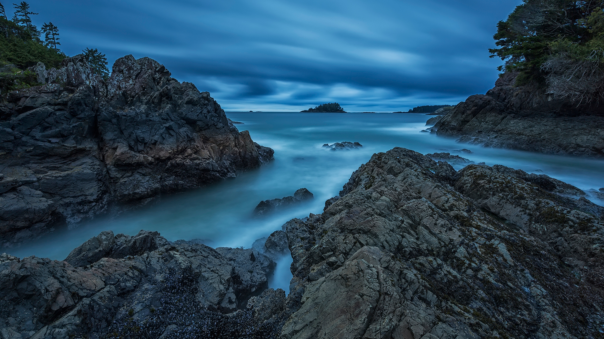

```json
{
  "images": [
    {
      "startdate": "20220503",
      "fullstartdate": "202205031600",
      "enddate": "20220504",
      "url": "/th?id=OHR.TofinoOcean_ZH-CN6555392161_UHD.jpg&rf=LaDigue_UHD.jpg&pid=hp&w=3840&h=2160&rs=1&c=4",
      "urlbase": "/th?id=OHR.TofinoOcean_ZH-CN6555392161",
      "copyright": "托菲诺的麦肯齐海滩，加拿大不列颠哥伦比亚省 (© Robert Postma/Plainpicture/Design Pics)",
      "copyrightlink": "/search?q=%e5%8a%a0%e6%8b%bf%e5%a4%a7+%e6%89%98%e8%8f%b2%e8%af%ba&form=hpcapt&mkt=zh-cn",
      "title": "太平洋的波涛",
      "quiz": "/search?q=Bing+homepage+quiz&filters=WQOskey:%22HPQuiz_20220503_TofinoOcean%22&FORM=HPQUIZ",
      "wp": true,
      "hsh": "9e899ebef1f6d2d2a196659ec378650e",
      "drk": 1,
      "top": 1,
      "bot": 1,
      "hs": []
    }
  ],
  "tooltips": {
    "loading": "正在加载...",
    "previous": "上一个图像",
    "next": "下一个图像",
    "walle": "此图片不能下载用作壁纸。",
    "walls": "下载今日美图。仅限用作桌面壁纸。"
  }
}
```
