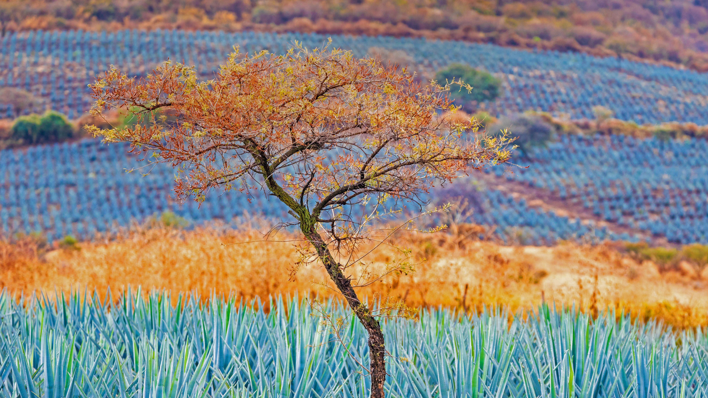

```json
{
  "images": [
    {
      "startdate": "20220504",
      "fullstartdate": "202205041600",
      "enddate": "20220505",
      "url": "/th?id=OHR.JaliscoAgave_ZH-CN6612544241_UHD.jpg&rf=LaDigue_UHD.jpg&pid=hp&w=3840&h=2160&rs=1&c=4",
      "urlbase": "/th?id=OHR.JaliscoAgave_ZH-CN6612544241",
      "copyright": "蓝色龙舌兰田，墨西哥哈利斯科州龙舌兰酒产区 (© Brian Overcast/Alamy)",
      "copyrightlink": "/search?q=%e8%93%9d%e8%89%b2%e9%be%99%e8%88%8c%e5%85%b0&form=hpcapt&mkt=zh-cn",
      "title": "这种蓝色多汁的植物就像黄金一样珍贵",
      "quiz": "/search?q=Bing+homepage+quiz&filters=WQOskey:%22HPQuiz_20220504_JaliscoAgave%22&FORM=HPQUIZ",
      "wp": true,
      "hsh": "2bf859be055b4c36003ea8b392f3fd9d",
      "drk": 1,
      "top": 1,
      "bot": 1,
      "hs": []
    }
  ],
  "tooltips": {
    "loading": "正在加载...",
    "previous": "上一个图像",
    "next": "下一个图像",
    "walle": "此图片不能下载用作壁纸。",
    "walls": "下载今日美图。仅限用作桌面壁纸。"
  }
}
```
