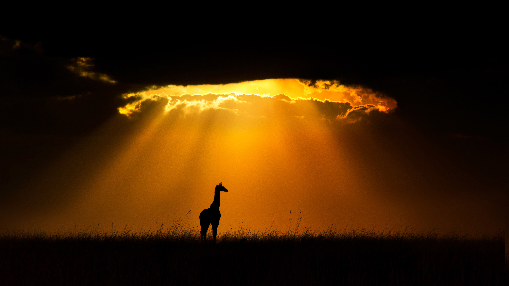

```json
{
  "images": [
    {
      "startdate": "20220512",
      "fullstartdate": "202205121600",
      "enddate": "20220513",
      "url": "/th?id=OHR.MaasaiGiraffe_ZH-CN2960157829_UHD.jpg&rf=LaDigue_UHD.jpg&pid=hp&w=3840&h=2160&rs=1&c=4",
      "urlbase": "/th?id=OHR.MaasaiGiraffe_ZH-CN2960157829",
      "copyright": "一只马赛长颈鹿，肯尼亚马赛马拉国家保护区 (© Andy Rouse/Minden Pictures)",
      "copyrightlink": "/search?q=%e9%a9%ac%e8%b5%9b%e9%95%bf%e9%a2%88%e9%b9%bf&form=hpcapt&mkt=zh-cn",
      "title": "独自在草原上",
      "quiz": "/search?q=Bing+homepage+quiz&filters=WQOskey:%22HPQuiz_20220512_MaasaiGiraffe%22&FORM=HPQUIZ",
      "wp": true,
      "hsh": "fdb30b54b969e985f567372ee274b1c0",
      "drk": 1,
      "top": 1,
      "bot": 1,
      "hs": []
    }
  ],
  "tooltips": {
    "loading": "正在加载...",
    "previous": "上一个图像",
    "next": "下一个图像",
    "walle": "此图片不能下载用作壁纸。",
    "walls": "下载今日美图。仅限用作桌面壁纸。"
  }
}
```
