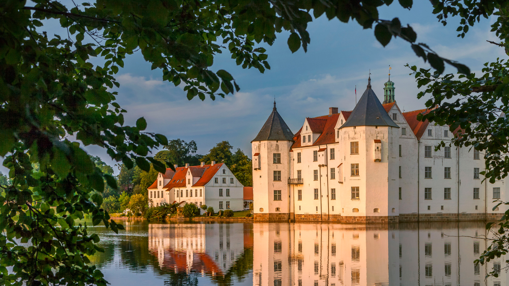

```json
{
  "images": [
    {
      "startdate": "20220517",
      "fullstartdate": "202205171600",
      "enddate": "20220518",
      "url": "/th?id=OHR.SchlossGluecksburg_ZH-CN4079837227_UHD.jpg&rf=LaDigue_UHD.jpg&pid=hp&w=3840&h=2160&rs=1&c=4",
      "urlbase": "/th?id=OHR.SchlossGluecksburg_ZH-CN4079837227",
      "copyright": "护城河边的格吕克斯堡城堡，德国 (© Christian Back/eStock Photo)",
      "copyrightlink": "/search?q=%e6%a0%bc%e5%90%95%e5%85%8b%e6%96%af%e5%a0%a1%e5%9f%8e%e5%a0%a1&form=hpcapt&mkt=zh-cn",
      "title": "位于弗伦斯堡峡湾的水上城堡",
      "quiz": "/search?q=Bing+homepage+quiz&filters=WQOskey:%22HPQuiz_20220517_SchlossGluecksburg%22&FORM=HPQUIZ",
      "wp": true,
      "hsh": "0104daee48bd0ea36ecddfbb9c31b67d",
      "drk": 1,
      "top": 1,
      "bot": 1,
      "hs": []
    }
  ],
  "tooltips": {
    "loading": "正在加载...",
    "previous": "上一个图像",
    "next": "下一个图像",
    "walle": "此图片不能下载用作壁纸。",
    "walls": "下载今日美图。仅限用作桌面壁纸。"
  }
}
```
