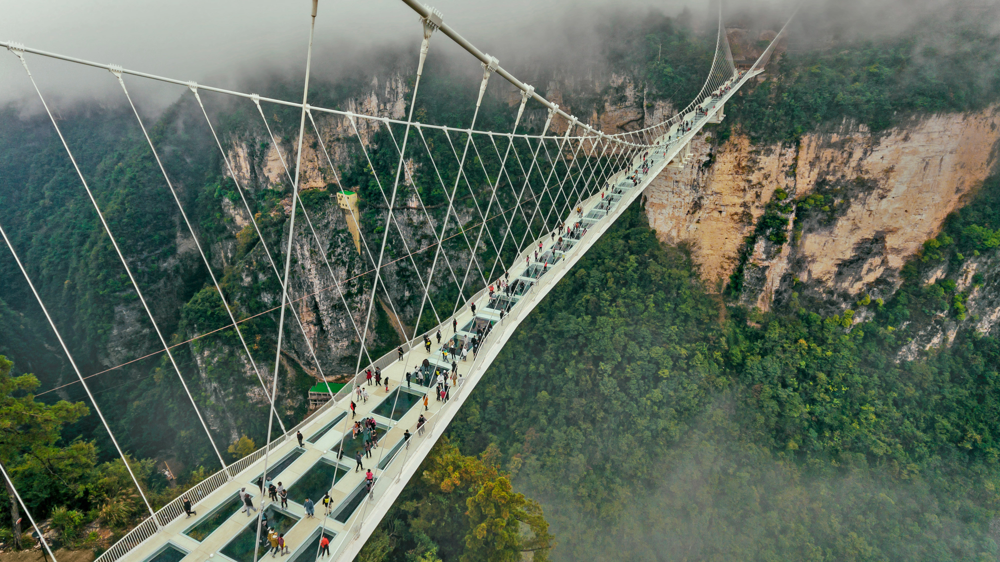

```json
{
  "images": [
    {
      "startdate": "20220518",
      "fullstartdate": "202205181600",
      "enddate": "20220519",
      "url": "/th?id=OHR.GlassBridge_ZH-CN4258621683_UHD.jpg&rf=LaDigue_UHD.jpg&pid=hp&w=3840&h=2160&rs=1&c=4",
      "urlbase": "/th?id=OHR.GlassBridge_ZH-CN4258621683",
      "copyright": "张家界大峡谷玻璃桥，湖南 (© MediaProduction/Getty Images)",
      "copyrightlink": "/search?q=%e5%bc%a0%e5%ae%b6%e7%95%8c%e5%a4%a7%e5%b3%a1%e8%b0%b7%e7%8e%bb%e7%92%83%e6%a1%a5&form=hpcapt&mkt=zh-cn",
      "title": "站在近300米高空的玻璃上",
      "quiz": "/search?q=Bing+homepage+quiz&filters=WQOskey:%22HPQuiz_20220518_GlassBridge%22&FORM=HPQUIZ",
      "wp": true,
      "hsh": "6f65ea0038b1ef7bdc17e07c2f1a0eaa",
      "drk": 1,
      "top": 1,
      "bot": 1,
      "hs": []
    }
  ],
  "tooltips": {
    "loading": "正在加载...",
    "previous": "上一个图像",
    "next": "下一个图像",
    "walle": "此图片不能下载用作壁纸。",
    "walls": "下载今日美图。仅限用作桌面壁纸。"
  }
}
```
