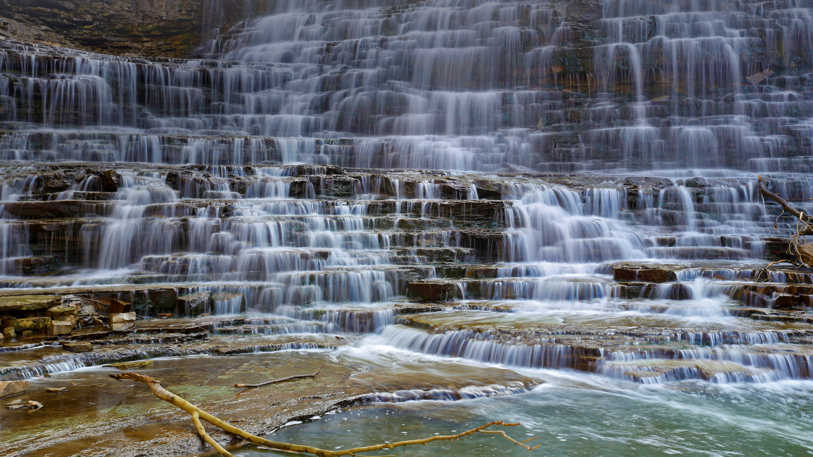

```json
{
  "images": [
    {
      "startdate": "20220520",
      "fullstartdate": "202205201600",
      "enddate": "20220521",
      "url": "/th?id=OHR.AlbionFalls_ZH-CN8302577218_UHD.jpg&rf=LaDigue_UHD.jpg&pid=hp&w=3840&h=2160&rs=1&c=4",
      "urlbase": "/th?id=OHR.AlbionFalls_ZH-CN8302577218",
      "copyright": "阿尔比恩瀑布，汉密尔顿，加拿大安大略省 (© Alexander Sviridov/Shutterstock)",
      "copyrightlink": "/search?q=%e5%8a%a0%e6%8b%bf%e5%a4%a7%e9%98%bf%e5%b0%94%e6%af%94%e6%81%a9%e7%80%91%e5%b8%83&form=hpcapt&mkt=zh-cn",
      "title": "“瀑布之城”中的小瀑布",
      "quiz": "/search?q=Bing+homepage+quiz&filters=WQOskey:%22HPQuiz_20220520_AlbionFalls%22&FORM=HPQUIZ",
      "wp": true,
      "hsh": "7aa6e7fe8ab4b81477a5ebb6cb87f135",
      "drk": 1,
      "top": 1,
      "bot": 1,
      "hs": []
    }
  ],
  "tooltips": {
    "loading": "正在加载...",
    "previous": "上一个图像",
    "next": "下一个图像",
    "walle": "此图片不能下载用作壁纸。",
    "walls": "下载今日美图。仅限用作桌面壁纸。"
  }
}
```
