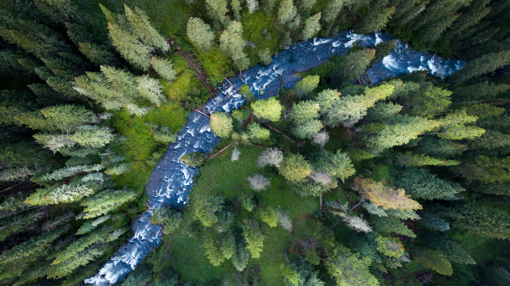

```json
{
  "images": [
    {
      "startdate": "20220528",
      "fullstartdate": "202205281600",
      "enddate": "20220529",
      "url": "/th?id=OHR.HyaliteCreek_ZH-CN0400013447_UHD.jpg&rf=LaDigue_UHD.jpg&pid=hp&w=3840&h=2160&rs=1&c=4",
      "urlbase": "/th?id=OHR.HyaliteCreek_ZH-CN0400013447",
      "copyright": "加勒廷国家森林里的小溪，美国蒙大拿州 (© Jared Lloyd/Getty Images)",
      "copyrightlink": "/search?q=%e5%8a%a0%e5%8b%92%e5%bb%b7%e5%9b%bd%e5%ae%b6%e6%a3%ae%e6%9e%97&form=hpcapt&mkt=zh-cn",
      "title": "垂钓者的天堂",
      "quiz": "/search?q=Bing+homepage+quiz&filters=WQOskey:%22HPQuiz_20220528_HyaliteCreek%22&FORM=HPQUIZ",
      "wp": true,
      "hsh": "a330040d247623e7256685002da995bd",
      "drk": 1,
      "top": 1,
      "bot": 1,
      "hs": []
    }
  ],
  "tooltips": {
    "loading": "正在加载...",
    "previous": "上一个图像",
    "next": "下一个图像",
    "walle": "此图片不能下载用作壁纸。",
    "walls": "下载今日美图。仅限用作桌面壁纸。"
  }
}
```
