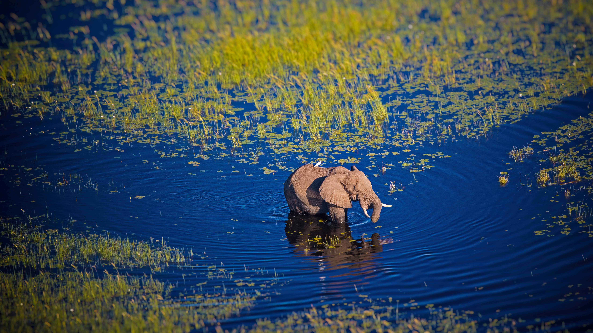

```json
{
  "images": [
    {
      "startdate": "20220612",
      "fullstartdate": "202206121600",
      "enddate": "20220613",
      "url": "/th?id=OHR.OkavangoElephant_ZH-CN0058670579_UHD.jpg&rf=LaDigue_UHD.jpg&pid=hp&w=3840&h=2160&rs=1&c=4",
      "urlbase": "/th?id=OHR.OkavangoElephant_ZH-CN0058670579",
      "copyright": "行走在奥卡万戈河中的大象，博茨瓦纳，非洲南部 (© Markus Pavlowsky/Getty Images)",
      "copyrightlink": "/search?q=%e5%a5%a5%e5%8d%a1%e4%b8%87%e6%88%88%e5%86%85%e9%99%86%e4%b8%89%e8%a7%92%e6%b4%b2&form=hpcapt&mkt=zh-cn",
      "title": "世界上最美好的绿洲？",
      "quiz": "/search?q=Bing+homepage+quiz&filters=WQOskey:%22HPQuiz_20220612_OkavangoElephant%22&FORM=HPQUIZ",
      "wp": true,
      "hsh": "b510e3055b1c991fdb9a65bdcb80e9bc",
      "drk": 1,
      "top": 1,
      "bot": 1,
      "hs": []
    }
  ],
  "tooltips": {
    "loading": "正在加载...",
    "previous": "上一个图像",
    "next": "下一个图像",
    "walle": "此图片不能下载用作壁纸。",
    "walls": "下载今日美图。仅限用作桌面壁纸。"
  }
}
```
