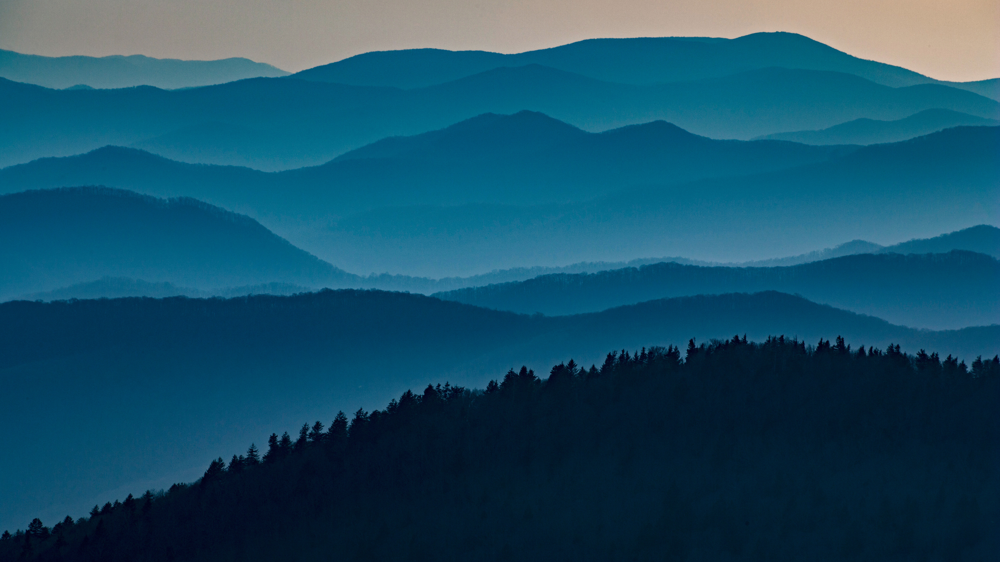

```json
{
  "images": [
    {
      "startdate": "20220614",
      "fullstartdate": "202206141600",
      "enddate": "20220615",
      "url": "/th?id=OHR.ClingmansDome_ZH-CN0900594339_UHD.jpg&rf=LaDigue_UHD.jpg&pid=hp&w=3840&h=2160&rs=1&c=4",
      "urlbase": "/th?id=OHR.ClingmansDome_ZH-CN0900594339",
      "copyright": "大雾山国家公园，田纳西州 (© Tony Barber/Getty Images)",
      "copyrightlink": "/search?q=%e5%a4%a7%e9%9b%be%e5%b1%b1%e5%9b%bd%e5%ae%b6%e5%85%ac%e5%9b%ad&form=hpcapt&mkt=zh-cn",
      "title": "田纳西之巅",
      "quiz": "/search?q=Bing+homepage+quiz&filters=WQOskey:%22HPQuiz_20220614_ClingmansDome%22&FORM=HPQUIZ",
      "wp": true,
      "hsh": "0fee1664ef104bfb2d58b4deb19a0178",
      "drk": 1,
      "top": 1,
      "bot": 1,
      "hs": []
    }
  ],
  "tooltips": {
    "loading": "正在加载...",
    "previous": "上一个图像",
    "next": "下一个图像",
    "walle": "此图片不能下载用作壁纸。",
    "walls": "下载今日美图。仅限用作桌面壁纸。"
  }
}
```
