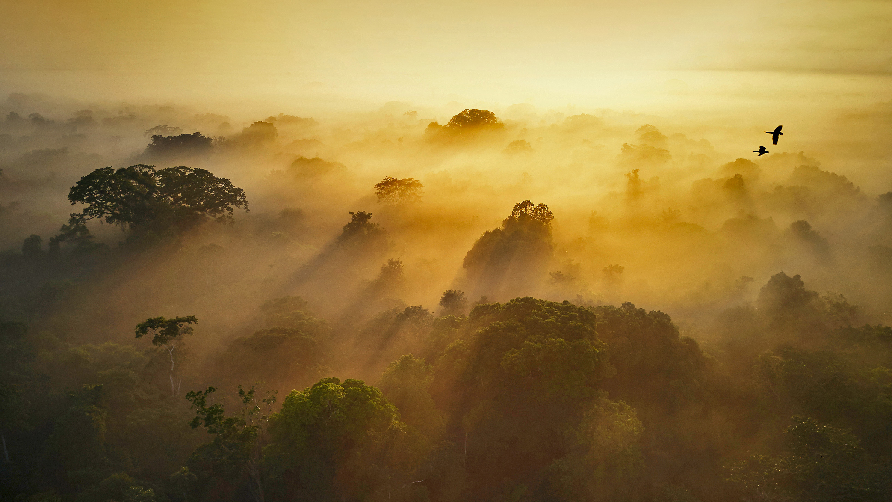

```json
{
  "images": [
    {
      "startdate": "20220621",
      "fullstartdate": "202206211600",
      "enddate": "20220622",
      "url": "/th?id=OHR.AmazonianEcuador_ZH-CN9873999948_UHD.jpg&rf=LaDigue_UHD.jpg&pid=hp&w=3840&h=2160&rs=1&c=4",
      "urlbase": "/th?id=OHR.AmazonianEcuador_ZH-CN9873999948",
      "copyright": "亚苏尼国家公园，厄瓜多尔 (© Paul Bertner/Minden Pictures)",
      "copyrightlink": "/search?q=%e4%ba%9a%e8%8b%8f%e5%b0%bc%e5%9b%bd%e5%ae%b6%e5%85%ac%e5%9b%ad&form=hpcapt&mkt=zh-cn",
      "title": "地球之肺",
      "quiz": "/search?q=Bing+homepage+quiz&filters=WQOskey:%22HPQuiz_20220621_AmazonianEcuador%22&FORM=HPQUIZ",
      "wp": true,
      "hsh": "54923db4c97b9514252b19dc16087240",
      "drk": 1,
      "top": 1,
      "bot": 1,
      "hs": []
    }
  ],
  "tooltips": {
    "loading": "正在加载...",
    "previous": "上一个图像",
    "next": "下一个图像",
    "walle": "此图片不能下载用作壁纸。",
    "walls": "下载今日美图。仅限用作桌面壁纸。"
  }
}
```
