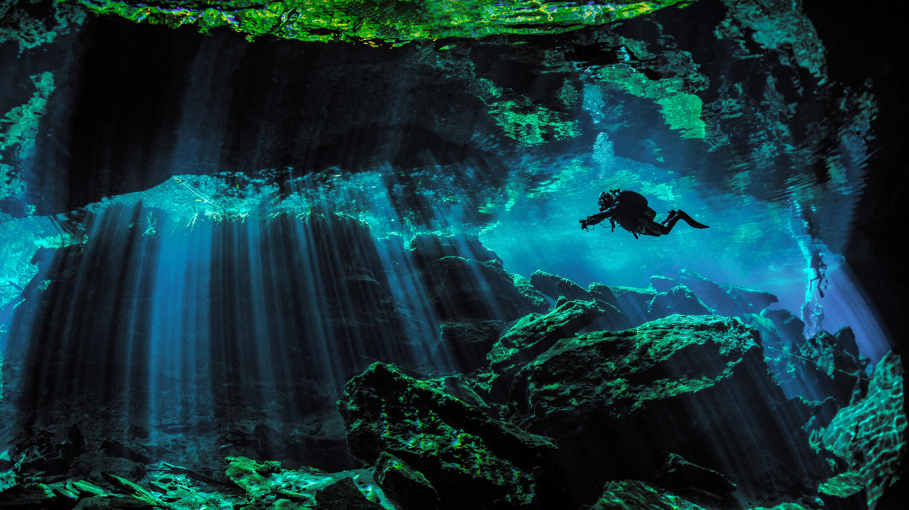

```json
{
  "images": [
    {
      "startdate": "20220623",
      "fullstartdate": "202206231600",
      "enddate": "20220624",
      "url": "/th?id=OHR.CenoteDiver_ZH-CN7334440742_UHD.jpg&rf=LaDigue_UHD.jpg&pid=hp&w=3840&h=2160&rs=1&c=4",
      "urlbase": "/th?id=OHR.CenoteDiver_ZH-CN7334440742",
      "copyright": "潜水员探索文图拉斯港附近的水下天然井，墨西哥 (© Extreme Photographer/Getty Images)",
      "copyrightlink": "/search?q=%e4%ba%9a%e8%8b%8f%e5%b0%bc%e5%9b%bd%e5%ae%b6%e5%85%ac%e5%9b%ad&form=hpcapt&mkt=zh-cn",
      "title": "地面之下的水中世界",
      "quiz": "/search?q=Bing+homepage+quiz&filters=WQOskey:%22HPQuiz_20220623_CenoteDiver%22&FORM=HPQUIZ",
      "wp": true,
      "hsh": "374def42f5cd64e50b04fb02b1235b0b",
      "drk": 1,
      "top": 1,
      "bot": 1,
      "hs": []
    }
  ],
  "tooltips": {
    "loading": "正在加载...",
    "previous": "上一个图像",
    "next": "下一个图像",
    "walle": "此图片不能下载用作壁纸。",
    "walls": "下载今日美图。仅限用作桌面壁纸。"
  }
}
```
