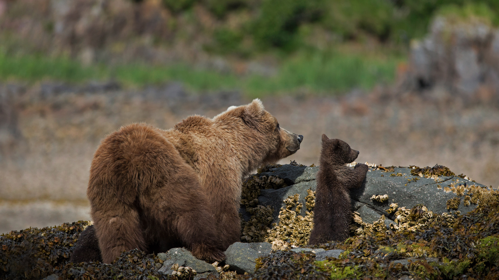

```json
{
  "images": [
    {
      "startdate": "20220624",
      "fullstartdate": "202206241600",
      "enddate": "20220625",
      "url": "/th?id=OHR.BBMomCub_ZH-CN7715738841_UHD.jpg&rf=LaDigue_UHD.jpg&pid=hp&w=3840&h=2160&rs=1&c=4",
      "urlbase": "/th?id=OHR.BBMomCub_ZH-CN7715738841",
      "copyright": "卡特迈国家公园和保护区的棕熊妈妈和幼崽，阿拉斯加 (© Suzi Eszterhas/Minden Pictures)",
      "copyrightlink": "/search?q=%e6%a3%95%e7%86%8a&form=hpcapt&mkt=zh-cn",
      "title": "夏天的棕熊",
      "quiz": "/search?q=Bing+homepage+quiz&filters=WQOskey:%22HPQuiz_20220624_BBMomCub%22&FORM=HPQUIZ",
      "wp": true,
      "hsh": "e942b4c3554e8585454cf20f4906fece",
      "drk": 1,
      "top": 1,
      "bot": 1,
      "hs": []
    }
  ],
  "tooltips": {
    "loading": "正在加载...",
    "previous": "上一个图像",
    "next": "下一个图像",
    "walle": "此图片不能下载用作壁纸。",
    "walls": "下载今日美图。仅限用作桌面壁纸。"
  }
}
```
