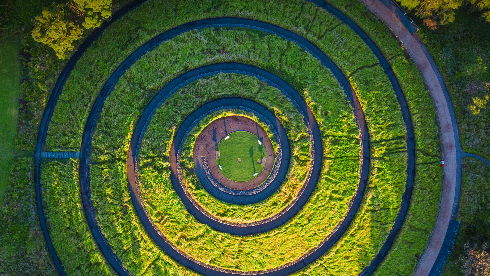

```json
{
  "images": [
    {
      "startdate": "20220711",
      "fullstartdate": "202207111600",
      "enddate": "20220712",
      "url": "/th?id=OHR.SpiralHill_ZH-CN3829252235_UHD.jpg&rf=LaDigue_UHD.jpg&pid=hp&w=3840&h=2160&rs=1&c=4",
      "urlbase": "/th?id=OHR.SpiralHill_ZH-CN3829252235",
      "copyright": "悉尼奥林匹克公园里的湾标瞭望台，澳大利亚 (© ai_yoshi/Getty Images)",
      "copyrightlink": "/search?q=%e6%82%89%e5%b0%bc%e5%a5%a5%e6%9e%97%e5%8c%b9%e5%85%8b%e5%85%ac%e5%9b%ad&form=hpcapt&mkt=zh-cn",
      "title": "螺旋上升……",
      "quiz": "/search?q=Bing+homepage+quiz&filters=WQOskey:%22HPQuiz_20220711_SpiralHill%22&FORM=HPQUIZ",
      "wp": true,
      "hsh": "b0b673c4bb7ca1cbcacf2fa560e11a1a",
      "drk": 1,
      "top": 1,
      "bot": 1,
      "hs": []
    }
  ],
  "tooltips": {
    "loading": "正在加载...",
    "previous": "上一个图像",
    "next": "下一个图像",
    "walle": "此图片不能下载用作壁纸。",
    "walls": "下载今日美图。仅限用作桌面壁纸。"
  }
}
```
