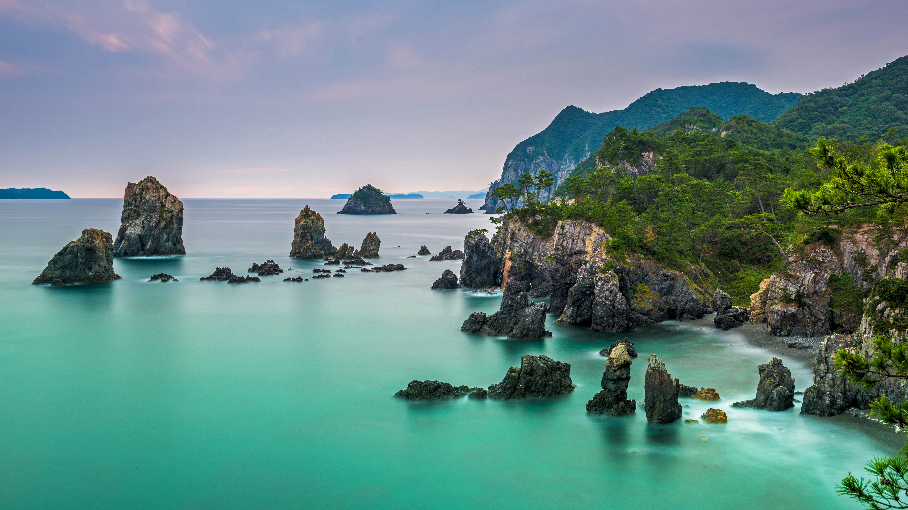

```json
{
  "images": [
    {
      "startdate": "20220717",
      "fullstartdate": "202207171600",
      "enddate": "20220718",
      "url": "/th?id=OHR.OmijimaIsland_ZH-CN3328515301_UHD.jpg&rf=LaDigue_UHD.jpg&pid=hp&w=3840&h=2160&rs=1&c=4",
      "urlbase": "/th?id=OHR.OmijimaIsland_ZH-CN3328515301",
      "copyright": "布满奇石的青海岛，日本北长门海岸国定公园 (© Sean Pavone Photo/Adobe Stock)",
      "copyrightlink": "/search?q=%e9%95%bf%e9%97%a8+%e9%9d%92%e6%b5%b7%e5%b2%9b&form=hpcapt&mkt=zh-cn",
      "title": "海上阿尔卑斯山",
      "quiz": "/search?q=Bing+homepage+quiz&filters=WQOskey:%22HPQuiz_20220717_OmijimaIsland%22&FORM=HPQUIZ",
      "wp": true,
      "hsh": "476415c4a34b140132129b567829290a",
      "drk": 1,
      "top": 1,
      "bot": 1,
      "hs": []
    }
  ],
  "tooltips": {
    "loading": "正在加载...",
    "previous": "上一个图像",
    "next": "下一个图像",
    "walle": "此图片不能下载用作壁纸。",
    "walls": "下载今日美图。仅限用作桌面壁纸。"
  }
}
```
