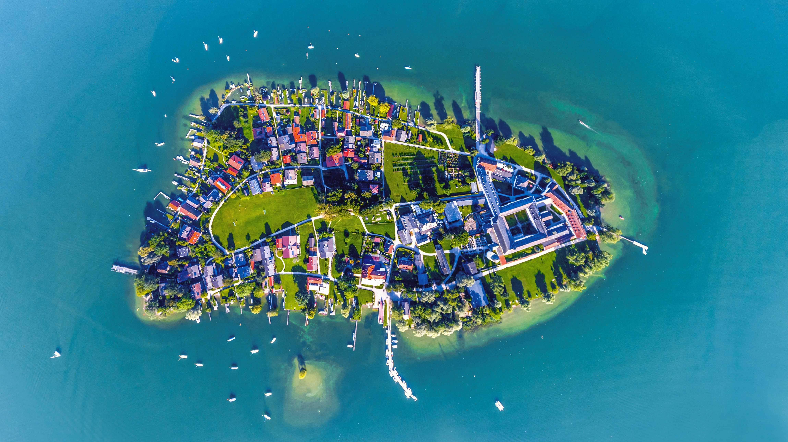

```json
{
  "images": [
    {
      "startdate": "20220718",
      "fullstartdate": "202207181600",
      "enddate": "20220719",
      "url": "/th?id=OHR.FraueninselChiemsee_ZH-CN3541482552_UHD.jpg&rf=LaDigue_UHD.jpg&pid=hp&w=3840&h=2160&rs=1&c=4",
      "urlbase": "/th?id=OHR.FraueninselChiemsee_ZH-CN3541482552",
      "copyright": "基姆湖上的淑女岛，德国巴伐利亚州 (© Malorny/Getty Images)",
      "copyrightlink": "/search?q=%e5%9f%ba%e5%a7%86%e6%b9%96&form=hpcapt&mkt=zh-cn",
      "title": "“巴伐利亚海”中的岛屿",
      "quiz": "/search?q=Bing+homepage+quiz&filters=WQOskey:%22HPQuiz_20220718_FraueninselChiemsee%22&FORM=HPQUIZ",
      "wp": true,
      "hsh": "b454d6cc4d0ac9b496c68af923bbdc37",
      "drk": 1,
      "top": 1,
      "bot": 1,
      "hs": []
    }
  ],
  "tooltips": {
    "loading": "正在加载...",
    "previous": "上一个图像",
    "next": "下一个图像",
    "walle": "此图片不能下载用作壁纸。",
    "walls": "下载今日美图。仅限用作桌面壁纸。"
  }
}
```
