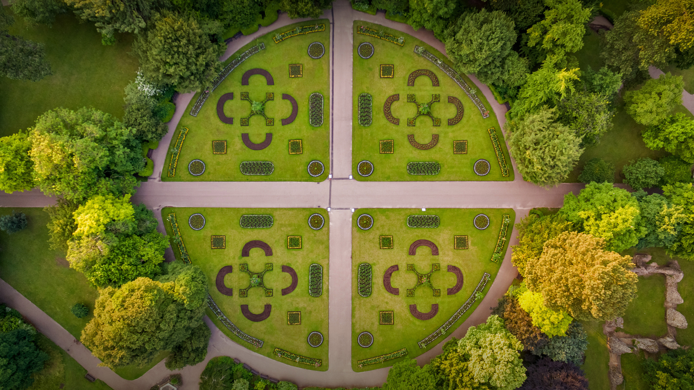

```json
{
  "images": [
    {
      "startdate": "20220720",
      "fullstartdate": "202207201600",
      "enddate": "20220721",
      "url": "/th?id=OHR.AbbeyGardens_ZH-CN4831631801_UHD.jpg&rf=LaDigue_UHD.jpg&pid=hp&w=3840&h=2160&rs=1&c=4",
      "urlbase": "/th?id=OHR.AbbeyGardens_ZH-CN4831631801",
      "copyright": "伯里圣埃德蒙兹镇的修道院公园，英国萨福克郡 (© Charles Martinez/Amazing Aerial Agency)",
      "copyrightlink": "/search?q=%e4%bc%af%e9%87%8c%e5%9c%a3%e5%9f%83%e5%be%b7%e8%92%99%e5%85%b9%e4%bf%ae%e9%81%93%e9%99%a2&form=hpcapt&mkt=zh-cn",
      "title": "绝妙的对称性",
      "quiz": "/search?q=Bing+homepage+quiz&filters=WQOskey:%22HPQuiz_20220720_AbbeyGardens%22&FORM=HPQUIZ",
      "wp": true,
      "hsh": "5a88eab60a112184aab3930d1b449159",
      "drk": 1,
      "top": 1,
      "bot": 1,
      "hs": []
    }
  ],
  "tooltips": {
    "loading": "正在加载...",
    "previous": "上一个图像",
    "next": "下一个图像",
    "walle": "此图片不能下载用作壁纸。",
    "walls": "下载今日美图。仅限用作桌面壁纸。"
  }
}
```
