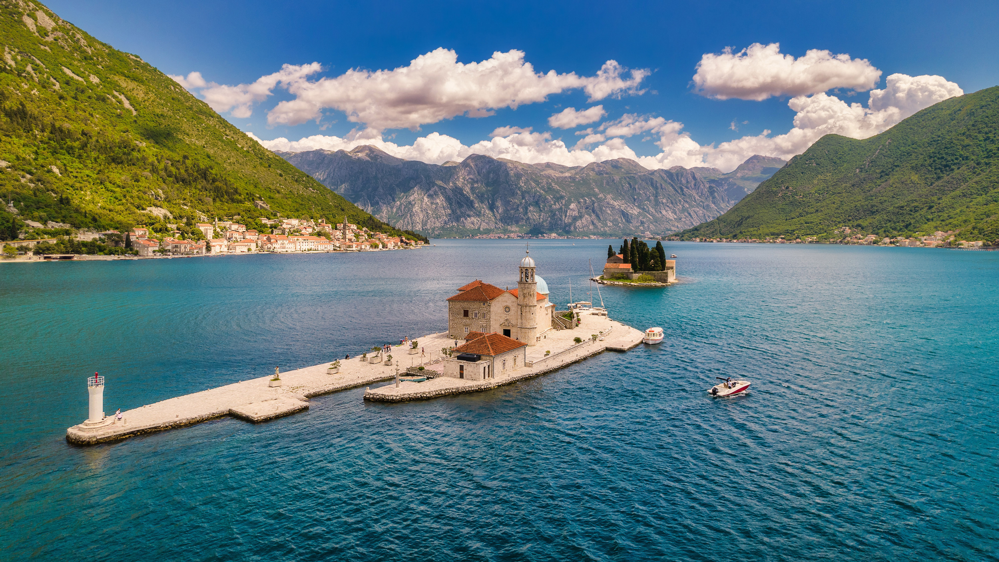

```json
{
  "images": [
    {
      "startdate": "20220721",
      "fullstartdate": "202207211600",
      "enddate": "20220722",
      "url": "/th?id=OHR.SGIMontenegro_ZH-CN4155831603_UHD.jpg&rf=LaDigue_UHD.jpg&pid=hp&w=3840&h=2160&rs=1&c=4",
      "urlbase": "/th?id=OHR.SGIMontenegro_ZH-CN4155831603",
      "copyright": "科托尔湾的圣乔治海峡和圣母湾，黑山 (© Dmitrii Sakharov/Shutterstock)",
      "copyrightlink": "/search?q=%e7%a7%91%e6%89%98%e5%b0%94%e6%b9%be+%e5%9c%a3%e6%af%8d%e5%b2%a9&form=hpcapt&mkt=zh-cn",
      "title": "用誓言打造的岛屿",
      "quiz": "/search?q=Bing+homepage+quiz&filters=WQOskey:%22HPQuiz_20220721_SGIMontenegro%22&FORM=HPQUIZ",
      "wp": true,
      "hsh": "e01a95ee39588a992c3ea3de216326ce",
      "drk": 1,
      "top": 1,
      "bot": 1,
      "hs": []
    }
  ],
  "tooltips": {
    "loading": "正在加载...",
    "previous": "上一个图像",
    "next": "下一个图像",
    "walle": "此图片不能下载用作壁纸。",
    "walls": "下载今日美图。仅限用作桌面壁纸。"
  }
}
```
