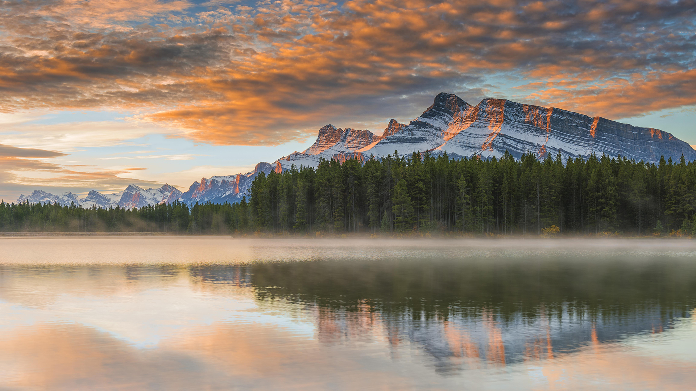

```json
{
  "images": [
    {
      "startdate": "20220723",
      "fullstartdate": "202207231600",
      "enddate": "20220724",
      "url": "/th?id=OHR.TwoJackLake_ZH-CN4716355677_UHD.jpg&rf=LaDigue_UHD.jpg&pid=hp&w=3840&h=2160&rs=1&c=4",
      "urlbase": "/th?id=OHR.TwoJackLake_ZH-CN4716355677",
      "copyright": "双杰克湖，班夫国家公园，艾伯塔省，加拿大 (© SnapRapid/Offset)",
      "copyrightlink": "/search?q=%e5%8f%8c%e6%9d%b0%e5%85%8b%e6%b9%96&form=hpcapt&mkt=zh-cn",
      "title": "落基山脉中出镜率最高的地方",
      "quiz": "/search?q=Bing+homepage+quiz&filters=WQOskey:%22HPQuiz_20220723_TwoJackLake%22&FORM=HPQUIZ",
      "wp": true,
      "hsh": "14957710b70e14fce8bda48dd94229e4",
      "drk": 1,
      "top": 1,
      "bot": 1,
      "hs": []
    }
  ],
  "tooltips": {
    "loading": "正在加载...",
    "previous": "上一个图像",
    "next": "下一个图像",
    "walle": "此图片不能下载用作壁纸。",
    "walls": "下载今日美图。仅限用作桌面壁纸。"
  }
}
```
