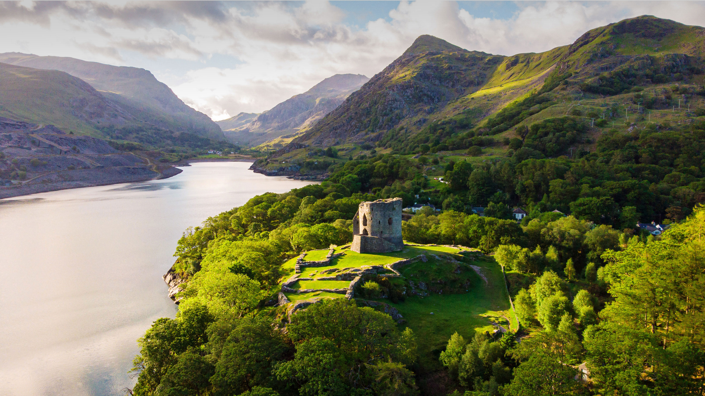

```json
{
  "images": [
    {
      "startdate": "20220724",
      "fullstartdate": "202207241600",
      "enddate": "20220725",
      "url": "/th?id=OHR.DolbadarnCastle_ZH-CN5397592090_UHD.jpg&rf=LaDigue_UHD.jpg&pid=hp&w=3840&h=2160&rs=1&c=4",
      "urlbase": "/th?id=OHR.DolbadarnCastle_ZH-CN5397592090",
      "copyright": "兰贝里斯山口脚下的多尔巴达恩城堡，威尔士 (© Viktoria Rodriguez/Getty Images)",
      "copyrightlink": "/search?q=%e5%a8%81%e5%b0%94%e5%a3%ab&form=hpcapt&mkt=zh-cn",
      "title": "守住关口",
      "quiz": "/search?q=Bing+homepage+quiz&filters=WQOskey:%22HPQuiz_20220724_DolbadarnCastle%22&FORM=HPQUIZ",
      "wp": true,
      "hsh": "5760197aa7a712e640e07690703db561",
      "drk": 1,
      "top": 1,
      "bot": 1,
      "hs": []
    }
  ],
  "tooltips": {
    "loading": "正在加载...",
    "previous": "上一个图像",
    "next": "下一个图像",
    "walle": "此图片不能下载用作壁纸。",
    "walls": "下载今日美图。仅限用作桌面壁纸。"
  }
}
```
