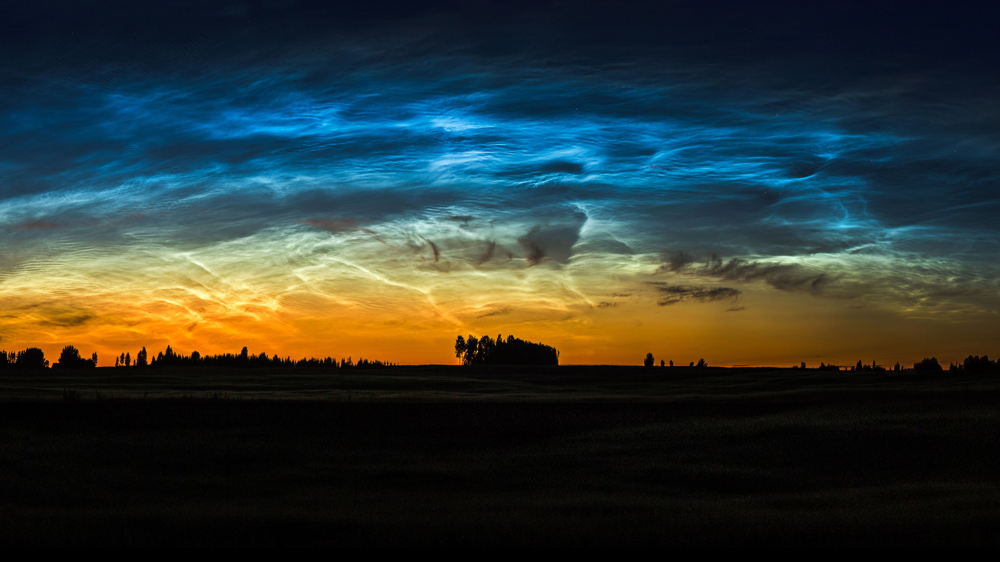

```json
{
  "images": [
    {
      "startdate": "20220730",
      "fullstartdate": "202207301600",
      "enddate": "20220731",
      "url": "/th?id=OHR.NoctilucentClouds_ZH-CN4816301354_UHD.jpg&rf=LaDigue_UHD.jpg&pid=hp&w=3840&h=2160&rs=1&c=4",
      "urlbase": "/th?id=OHR.NoctilucentClouds_ZH-CN4816301354",
      "copyright": "立陶宛的夜光云 (© ljphoto7/Getty Images)",
      "copyrightlink": "/search?q=%e5%a4%9c%e5%85%89%e4%ba%91&form=hpcapt&mkt=zh-cn",
      "title": "“夜光”云",
      "quiz": "/search?q=Bing+homepage+quiz&filters=WQOskey:%22HPQuiz_20220730_NoctilucentClouds%22&FORM=HPQUIZ",
      "wp": true,
      "hsh": "2b5e8da475206a5e77a2b43f7edcc375",
      "drk": 1,
      "top": 1,
      "bot": 1,
      "hs": []
    }
  ],
  "tooltips": {
    "loading": "正在加载...",
    "previous": "上一个图像",
    "next": "下一个图像",
    "walle": "此图片不能下载用作壁纸。",
    "walls": "下载今日美图。仅限用作桌面壁纸。"
  }
}
```
