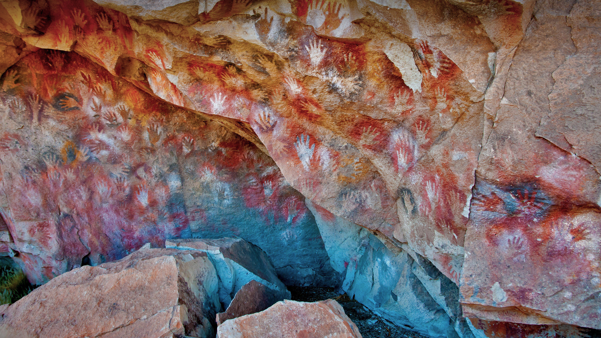

```json
{
  "images": [
    {
      "startdate": "20220808",
      "fullstartdate": "202208081600",
      "enddate": "20220809",
      "url": "/th?id=OHR.CuevaManos_ZH-CN8900667928_UHD.jpg&rf=LaDigue_UHD.jpg&pid=hp&w=3840&h=2160&rs=1&c=4",
      "urlbase": "/th?id=OHR.CuevaManos_ZH-CN8900667928",
      "copyright": "阿根廷圣克鲁斯的洛斯马诺斯洞穴 (© Adwo/Alamy)",
      "copyrightlink": "/search?q=%e6%b4%9b%e6%96%af%e9%a9%ac%e8%af%ba%e6%96%af%e5%b2%a9%e7%94%bb&form=hpcapt&mkt=zh-cn",
      "title": "9000年前的手印",
      "quiz": "/search?q=Bing+homepage+quiz&filters=WQOskey:%22HPQuiz_20220808_CuevaManos%22&FORM=HPQUIZ",
      "wp": true,
      "hsh": "51d1da8d9843be9b43351b068c6d97c3",
      "drk": 1,
      "top": 1,
      "bot": 1,
      "hs": []
    }
  ],
  "tooltips": {
    "loading": "正在加载...",
    "previous": "上一个图像",
    "next": "下一个图像",
    "walle": "此图片不能下载用作壁纸。",
    "walls": "下载今日美图。仅限用作桌面壁纸。"
  }
}
```
