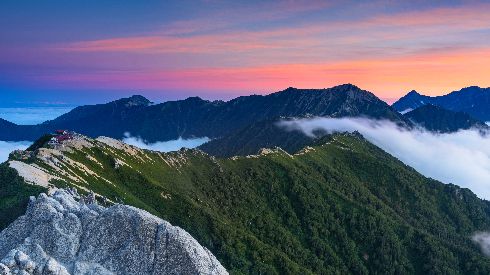

```json
{
  "images": [
    {
      "startdate": "20220810",
      "fullstartdate": "202208101600",
      "enddate": "20220811",
      "url": "/th?id=OHR.MtTsubakuro_ZH-CN0305525340_UHD.jpg&rf=LaDigue_UHD.jpg&pid=hp&w=3840&h=2160&rs=1&c=4",
      "urlbase": "/th?id=OHR.MtTsubakuro_ZH-CN0305525340",
      "copyright": "日本长野县安昙野附近的燕岳山 (© Joshua Hawley/Getty Images)",
      "copyrightlink": "/search?q=%e6%97%a5%e6%9c%ac%e9%95%bf%e9%87%8e%e5%8e%bf&form=hpcapt&mkt=zh-cn",
      "title": "如果可以的话，请拥抱一座山吧",
      "quiz": "/search?q=Bing+homepage+quiz&filters=WQOskey:%22HPQuiz_20220810_MtTsubakuro%22&FORM=HPQUIZ",
      "wp": true,
      "hsh": "ef8c7494ad4e743271002f9bf6da9625",
      "drk": 1,
      "top": 1,
      "bot": 1,
      "hs": []
    }
  ],
  "tooltips": {
    "loading": "正在加载...",
    "previous": "上一个图像",
    "next": "下一个图像",
    "walle": "此图片不能下载用作壁纸。",
    "walls": "下载今日美图。仅限用作桌面壁纸。"
  }
}
```
