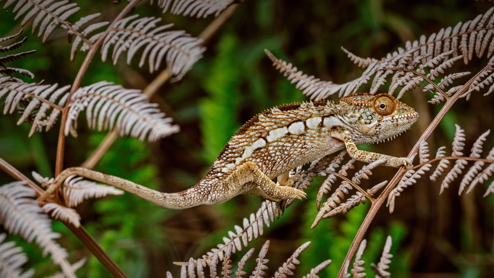

```json
{
  "images": [
    {
      "startdate": "20220813",
      "fullstartdate": "202208131600",
      "enddate": "20220814",
      "url": "/th?id=OHR.PantherChameleon_ZH-CN2554514270_UHD.jpg&rf=LaDigue_UHD.jpg&pid=hp&w=3840&h=2160&rs=1&c=4",
      "urlbase": "/th?id=OHR.PantherChameleon_ZH-CN2554514270",
      "copyright": "琥珀山国家公园里的豹变色龙，马达加斯加 (© Christian Ziegler/Minden Pictures)",
      "copyrightlink": "/search?q=%e8%b1%b9%e5%8f%98%e8%89%b2%e9%be%99&form=hpcapt&mkt=zh-cn",
      "title": "捉迷藏世界冠军",
      "quiz": "/search?q=Bing+homepage+quiz&filters=WQOskey:%22HPQuiz_20220813_PantherChameleon%22&FORM=HPQUIZ",
      "wp": true,
      "hsh": "6bbe6524a4edacc4fe6959750d42f8a5",
      "drk": 1,
      "top": 1,
      "bot": 1,
      "hs": []
    }
  ],
  "tooltips": {
    "loading": "正在加载...",
    "previous": "上一个图像",
    "next": "下一个图像",
    "walle": "此图片不能下载用作壁纸。",
    "walls": "下载今日美图。仅限用作桌面壁纸。"
  }
}
```
