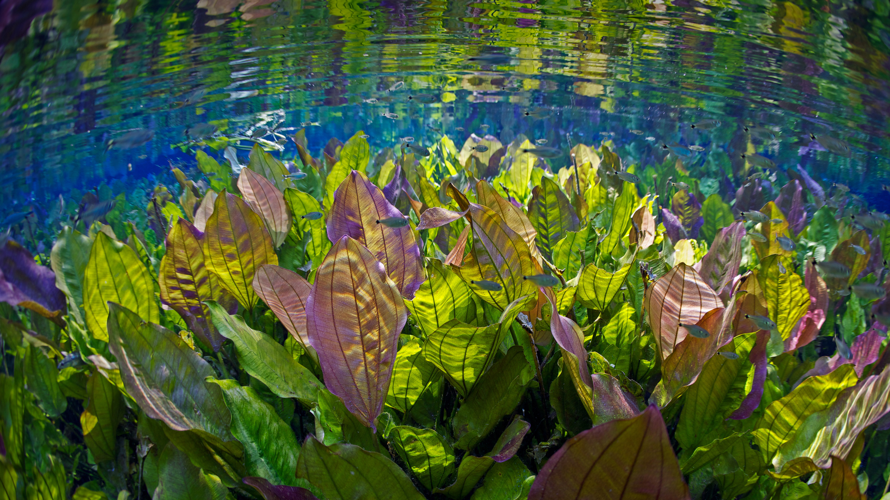

```json
{
  "images": [
    {
      "startdate": "20220816",
      "fullstartdate": "202208161600",
      "enddate": "20220817",
      "url": "/th?id=OHR.AquarioNatural_ZH-CN3886634374_UHD.jpg&rf=LaDigue_UHD.jpg&pid=hp&w=3840&h=2160&rs=1&c=4",
      "urlbase": "/th?id=OHR.AquarioNatural_ZH-CN3886634374",
      "copyright": "大自然的水族馆中的水下景观，巴西 (© Michel Roggo/Minden Pictures)",
      "copyrightlink": "/search?q=%e5%b7%b4%e8%a5%bf+%e5%a4%a7%e8%87%aa%e7%84%b6%e7%9a%84%e6%b0%b4%e6%97%8f%e9%a6%86&FORM=hpcapt&mkt=zh-cn",
      "title": "如此清澈，如此洁净",
      "quiz": "/search?q=Bing+homepage+quiz&filters=WQOskey:%22HPQuiz_20220816_AquarioNatural%22&FORM=HPQUIZ",
      "wp": true,
      "hsh": "bb8b6039d8c374348de5d947f149b343",
      "drk": 1,
      "top": 1,
      "bot": 1,
      "hs": []
    }
  ],
  "tooltips": {
    "loading": "正在加载...",
    "previous": "上一个图像",
    "next": "下一个图像",
    "walle": "此图片不能下载用作壁纸。",
    "walls": "下载今日美图。仅限用作桌面壁纸。"
  }
}
```
